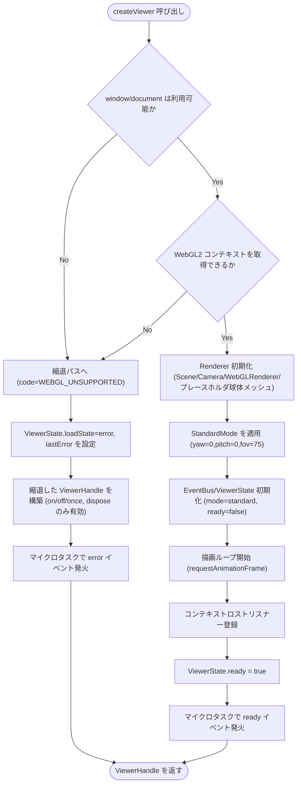
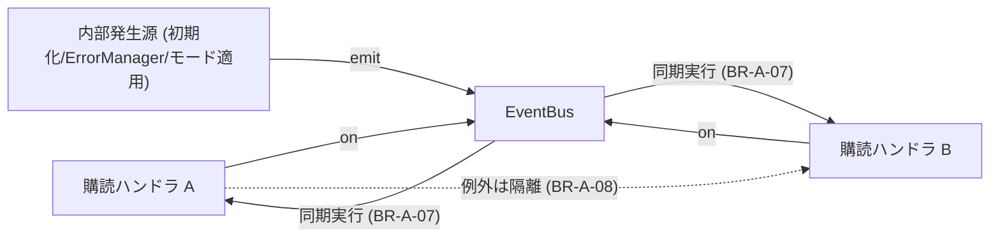
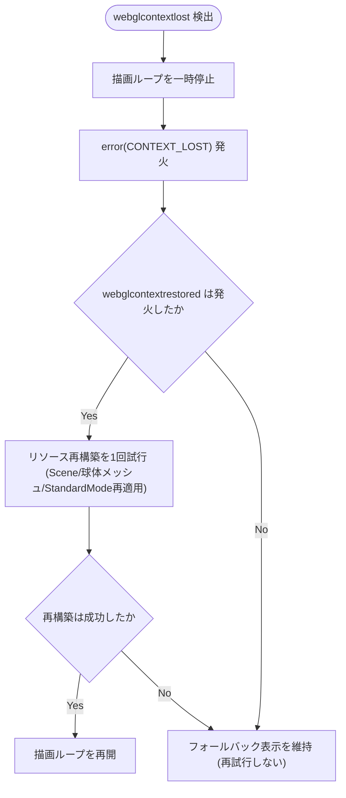
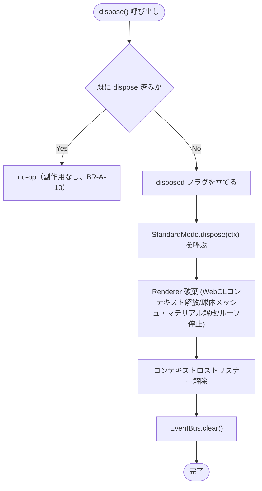

# Business Logic Model — UoW-A コア基盤

- **関連 Issue**: [#27](https://github.com/AtsutoNakayama/perisphere/issues/27)
- **作成日**: 2026-08-02
- **前提資料**: `domain-entities.md`、`business-rules.md`

## スコープと前提（レビュー時に確認いただきたい設計判断）

UoW-A は「1 枚の画像を標準ビューで表示」という最初の到達点（`unit-of-work-dependency.md` M1+M2）のうち、**基盤部分（M1）のみ**を担う。画像そのものの取得・テクスチャ化は UoW-B の責務であり、UoW-A 単体では以下を提供する:

- SSR セーフな初期化とライフサイクル統括
- three.js による描画基盤（シーン・カメラ・レンダラ・プレースホルダ球体メッシュ）と描画ループ
- 標準ビュー（`ViewerMode` の最小実装）の適用
- 型付きイベント・状態保持・エラー正規化・確実なリソース解放

この境界（特に「球体メッシュは UoW-A が生成し、テクスチャの反映は UoW-B が行う」という設計判断）は `business-rules.md` BR-A-15 に明記した。Functional Design の承認時に想定と異なる場合はご指摘いただきたい。

## プロセス一覧

| # | プロセス | 対応ストーリー | 主なルール |
|---|---|---|---|
| P1 | 初期化（ブートストラップ） | US-06, US-34 | BR-A-01〜06 |
| P2 | 描画ループ | US-36 | BR-A-18 |
| P3 | イベント購読・発火 | US-29 | BR-A-07, BR-A-08 |
| P4 | モード適用・切替要求（標準のみ） | US-06 | BR-A-06, BR-A-17 |
| P5 | エラー処理とフォールバック | US-30 | BR-A-03, BR-A-13 |
| P6 | コンテキストロスト検出・復帰 | US-37 | BR-A-12 |
| P7 | 破棄（dispose） | US-31 | BR-A-09〜11 |

## P1: 初期化（ブートストラップ）

`createViewer(container, options)` が呼ばれてから `ViewerHandle` を返すまでの処理。BR-A-01〜06 を参照。



### テキスト代替

```text
1. createViewer(container, options) が呼ばれる
2. 環境ガード: window/document が利用不可 → 縮退パスへ（手順8）
3. WebGL2 コンテキスト取得: 失敗 → 縮退パスへ（手順8）
4. Renderer 初期化（Scene/Camera/WebGLRenderer/プレースホルダ球体メッシュ生成）
5. StandardMode 適用（既定 yaw/pitch/fov をカメラへ設定）
6. EventBus/ViewerState 初期化（mode=standard, ready=false）
7. 描画ループ開始 → コンテキストロストリスナー登録 → ready=true →
   マイクロタスクで ready イベント発火 → ViewerHandle を返す（正常終了）
8. [縮退パス] ViewerState.loadState=error, lastError を設定
9. 縮退した ViewerHandle を構築（on/off/once, dispose のみ有効）
10. マイクロタスクで error イベント発火 → ViewerHandle を返す（縮退終了）
```

## P2: 描画ループ

- `requestAnimationFrame` により駆動。1 フレームにつき 1 回、現在の `ViewerMode`（UoW-A では `StandardMode` 固定）が設定したカメラでシーンを描画する（BR-A-18）。
- `dispose()` 呼び出しでループを停止する（P7 参照）。
- 具体的な性能チューニング（ピクセル比上限・アンチエイリアス設定等、NFR-01/US-36 の 60fps 目安達成に関わる詳細）は NFR Design ステージで確定する。本ユニットでは「単一ループで多重描画しない」という業務ルールのみを扱う。

## P3: イベント購読・発火

- `ViewerHandle.on/off/once` は `EventBus`（E4）へ委譲する。
- `emit` は同期実行（BR-A-07）。ハンドラ内の例外は隔離される（BR-A-08）。
- UoW-A が発火するイベント: `ready`（初期化完了時、1 回）、`error`（BR-A-03/BR-A-12 の失敗時）、`modechange`（UoW-A では標準固定のため実質発火しないが、型・配線は用意する）。



### テキスト代替

```text
内部発生源（初期化完了・ErrorManager・モード適用）が EventBus.emit を呼ぶ
EventBus は登録済みの全ハンドラを同期的に順次実行する
あるハンドラが例外を throw しても、他のハンドラの実行には影響しない
```

## P4: モード適用・切替要求（標準のみ）

- `getMode()` は常に `'standard'` を返す。
- `setMode('standard')` は no-op（既に標準のため実質的な変更なし）。
- `setMode()` に `'standard'` 以外の値が渡された場合は `INVALID_INPUT` として `error` イベントを発火し、モードは変更しない（BR-A-17）。UoW-C 統合後、`ModeRegistry` が導入されると本ロジックは登録簿参照に置き換わる。

## P5: エラー処理とフォールバック

UoW-A が正規化する失敗要因は 2 種類。

| 失敗要因 | 発生タイミング | `PerisphereError.code` | 挙動 |
|---|---|---|---|
| SSR 環境での呼び出し / WebGL2 非対応 | 初期化時 | `WEBGL_UNSUPPORTED` | 縮退した `ViewerHandle` を返し `error` 発火（BR-A-01〜04） |
| WebGL コンテキストロスト（復帰失敗を含む） | 実行中 | `CONTEXT_LOST` | 描画停止＋`error` 発火。復帰試行は 1 回のみ（P6/BR-A-12） |

いずれの場合も `PerisphereError.message` は内部詳細を含まない安全な文言とする（BR-A-13）。`setMode` への不正値（P4）は `INVALID_INPUT` として同じ `error` 経路で通知するが、初期化・描画そのものは継続する点で上記 2 種と扱いが異なる。

## P6: コンテキストロスト検出・復帰



### テキスト代替

```text
1. webglcontextlost を検出 → 描画ループを一時停止 → error(CONTEXT_LOST) を発火
2. webglcontextrestored が発火したら、リソース再構築を1回だけ試行
   (Scene/プレースホルダ球体メッシュ/StandardMode の再適用)
3. 再構築成功 → 描画ループを再開
4. 再構築失敗、または webglcontextrestored が発火しない → フォールバック表示を維持（再試行しない）
```

## P7: 破棄（dispose）



### テキスト代替

```text
1. dispose() が呼ばれる
2. 既に dispose 済みなら no-op（副作用なし）で終了
3. 未 dispose なら disposed フラグを立てて以下を順に実行:
   a. StandardMode.dispose(ctx)
   b. Renderer 破棄（WebGLコンテキスト解放・球体メッシュ/マテリアル解放・描画ループ停止）
   c. コンテキストロストリスナー解除
   d. EventBus.clear()
4. dispose 後に他メソッドが呼ばれた場合は no-op + console.warn（BR-A-09）
```
