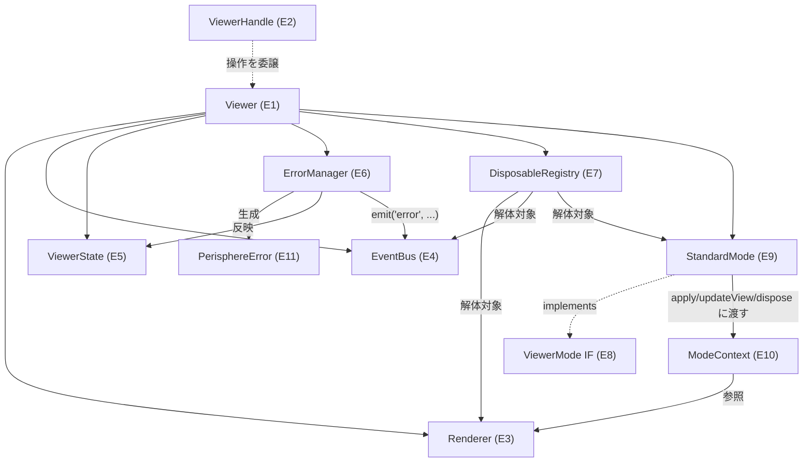

# Domain Entities — UoW-A コア基盤

- **関連 Issue**: [#27](https://github.com/AtsutoNakayama/perisphere/issues/27)
- **作成日**: 2026-08-02
- **前提資料**: `uow-a-functional-design-plan.md`（Q1〜Q9 回答）、Inception `components.md` / `component-methods.md` / `services.md`
- **注記**: ここでの型・シグネチャは業務ロジック上の意味を示す擬似定義。実装言語上の最終形は Code Generation ステージで確定する。

## エンティティ一覧

| # | 名称 | 種別 | 対応 Inception コンポーネント | 概要 |
|---|---|---|---|---|
| E1 | `Viewer` | 内部エンティティ（集約ルート） | C2 | 1 インスタンス＝1 ビューワー。他の全内部エンティティを結線・所有する |
| E2 | `ViewerHandle` | 公開ファサード（UoW-A 担当分のみ） | C1（部分） | `on/off/once`・`dispose`・`getMode`・`setMode`（標準モードのみ有効）を公開 |
| E3 | `Renderer` | 内部エンティティ | C3 | シーン・カメラ・WebGL レンダラ・球体メッシュ（プレースホルダ）・描画ループ・コンテキストロスト検出/復帰を保持 |
| E4 | `EventBus<M>` | 内部エンティティ（汎用） | C11 | 型付き購読/発火。UoW-A では `ready`/`error`/`modechange` を発火 |
| E5 | `ViewerState` | 値オブジェクト | C12 | `mode` / `ready` / `loadState` / `lastError` の最小集合を保持するプレーンな状態 |
| E6 | `ErrorManager` | 内部エンティティ | C14 | 発生した失敗を `PerisphereError` へ正規化し、`ViewerState`/`EventBus` に反映する |
| E7 | `DisposableRegistry` | 内部エンティティ（横断機構） | C15 | dispose 対象（Renderer・EventBus・ViewerMode 等）の解体手順を集約し、冪等性を保証する |
| E8 | `ViewerMode`（IF） | 公開拡張 IF | C5（IF 部分） | `id` / `defaultZoomLimits?` / `apply(ctx)` / `updateView(ctx, view)` / `dispose(ctx)` |
| E9 | `StandardMode` | `ViewerMode` の実装 | C5（標準実装） | `id = 'standard'`。既定 yaw/pitch/fov をカメラへ適用する最小実装 |
| E10 | `ModeContext` | 値オブジェクト | （C5 IF が要求する引数型） | `ViewerMode` の各フックに渡す描画ハンドル（`camera`/`scene`/`sphereMesh` への参照） |
| E11 | `PerisphereError` | 値オブジェクト | （`component-methods.md` 共通型） | `code` / `message`（内部詳細を含まない利用者向け安全な文言） |

## エンティティ詳細

### E1 `Viewer`（内部・集約ルート）

- **保持**: `Renderer`（E3）、`EventBus`（E4）、`ViewerState`（E5）、`ErrorManager`（E6）、`DisposableRegistry`（E7）、現在の `ViewerMode` インスタンス（UoW-A では `StandardMode` 固定）
- **公開**: `ViewerHandle`（E2）経由でのみ外部に触れられる（ファサードパターン）
- **ライフサイクル**: `createViewer` で 1 回だけ構築。`dispose()` で不可逆に終了する

### E2 `ViewerHandle`（UoW-A 担当分）

UoW-A 時点で実装するメンバーのみ（Q9=A）。他ユニットのメンバー（`loadImage`/`setView`/`next`/`enterFullscreen` 等）は該当ユニットのマージ時に追加される。

```text
interface ViewerHandle {
  // イベント（FR-17 / US-29）
  on<K extends 'ready' | 'error' | 'modechange'>(type: K, handler: (e: ViewerEventMap[K]) => void): void;
  off<K extends 'ready' | 'error' | 'modechange'>(type: K, handler: (e: ViewerEventMap[K]) => void): void;
  once<K extends 'ready' | 'error' | 'modechange'>(type: K, handler: (e: ViewerEventMap[K]) => void): void;

  // モード（標準のみ有効 / US-06）
  getMode(): 'standard';
  setMode(mode: 'standard'): void;   // 'standard' 以外を渡すとエラー（BR-A-17 参照）

  // ライフサイクル（US-31）
  dispose(): void;
}
```

### E3 `Renderer`

- **保持**: シーングラフ・カメラ（`StandardMode` が用いる透視カメラ）・WebGL レンダラ・**プレースホルダの球体メッシュ**（無地マテリアル。テクスチャは UoW-B 統合後に反映される。BR-A-15 参照）
- **責務**: 描画ループの駆動（`requestAnimationFrame`）、`webglcontextlost`/`webglcontextrestored` の検出とハンドリング
- **境界**: 投影の「数式」は持たない。`ViewerMode.apply/updateView` の指示に従ってカメラ等を更新するのみ（`component-dependency.md` の境界と一致）

### E4 `EventBus<M>`

- **保持**: イベント種別ごとのハンドラ配列
- **振る舞い**: `emit` は登録済みハンドラを**同期的に**順次実行する（BR-A-07）。個々のハンドラの例外は隔離される（BR-A-08）
- **UoW-A が発火するイベント**: `ready`（初期化完了）・`error`（`PerisphereError`）・`modechange`（`{ mode: 'standard' }`。UoW-A ではモード遷移先が標準のみのため実質発火されない静的なケースだが、型・機構は用意する）

### E5 `ViewerState`（UoW-A スコープ）

```text
interface ViewerState {
  mode: 'standard';                          // UoW-C 統合後は ViewerModeId 全体に拡張
  ready: boolean;                            // 初期化完了フラグ
  loadState: 'idle' | 'loading' | 'ready' | 'error';
  lastError: PerisphereError | null;
}
```

**注記（レビュー対象の想定）**: `loadState` は UoW-A の初期化処理自体の状態を表す（画像ロードの進捗ではない）。UoW-A の初期化は同期処理のため、実際には `idle → ready` または `idle → error` の遷移のみが観測され、`loading` は UoW-A では到達しない。この値は UoW-B（画像ロード）が非同期処理中に用いることを見込んだ予約値。命名の意味が UoW-B 統合時に紛らわしくなる懸念があれば、UoW-B の Functional Design 時点で名称の見直し（例: `bootState` への改名）を検討する。

### E6 `ErrorManager`

- **責務**: 発生した失敗要因（環境ガード失敗・WebGL2 非対応・コンテキストロスト）を `PerisphereError` に正規化し、`ViewerState.lastError` へ反映、`EventBus` 経由で `error` を発火する
- **境界**: 内部詳細（スタックトレース・内部パス）を含めない（SECURITY-09 / BR-A-13）

### E7 `DisposableRegistry`

- **責務**: dispose 対象（`Renderer`・`EventBus`・現在の `ViewerMode`）の解体を決まった順序で 1 回だけ実行する（BR-A-10・BR-A-11）
- **公開**: `Viewer` 内部からのみ利用（`ViewerHandle.dispose()` 経由）

### E8 `ViewerMode`（IF）/ E9 `StandardMode`

```text
interface ViewerMode {
  readonly id: string;
  readonly defaultZoomLimits?: { minFov: number; maxFov: number };
  apply(ctx: ModeContext): void;
  updateView(ctx: ModeContext, view: { yaw: number; pitch: number; fov: number }): void;
  dispose(ctx: ModeContext): void;
}

class StandardMode implements ViewerMode {
  readonly id = 'standard';
  readonly defaultZoomLimits = { minFov: 30, maxFov: 90 }; // BR-A-06
  apply(ctx: ModeContext): void { /* camera に yaw=0,pitch=0,fov=75 を設定 */ }
  updateView(ctx: ModeContext, view): void { /* camera へ view を反映（UoW-D 統合前は未使用） */ }
  dispose(ctx: ModeContext): void { /* カメラ設定の解除（three.js オブジェクト自体は Renderer が破棄） */ }
}
```

`updateView` の `view` 引数は `component-methods.md` の `ViewState`（`yaw`/`pitch`/`fov`）と同一形状。本ドキュメントの擬似コードは概念提示のみで、実装時の型定義は Code Generation で確定する。

### E10 `ModeContext`

```text
interface ModeContext {
  camera: /* 内部の透視カメラへの参照 */;
  scene: /* 内部のシーングラフへの参照 */;
  sphereMesh: /* 内部の球体メッシュへの参照（UoW-A ではプレースホルダマテリアル） */;
}
```

UoW-C（投影モード拡張）が異なるカメラ種別・メッシュ操作を行えるよう、`ModeContext` は `Renderer` の内部ハンドルへの参照を渡す設計とする（`Renderer` 自体を `ViewerMode` に直接握らせない疎結合の意図は維持）。

### E11 `PerisphereError`

```text
interface PerisphereError {
  code: 'IMAGE_LOAD_FAILED' | 'WEBGL_UNSUPPORTED' | 'CONTEXT_LOST' | 'INVALID_INPUT' | 'UNSUPPORTED_FORMAT';
  message: string;
}
```

UoW-A が実際に生成しうる `code` は `WEBGL_UNSUPPORTED`（環境ガード失敗・WebGL2 非対応を統合、BR-A-03）と `CONTEXT_LOST`（コンテキストロスト）の 2 種のみ。他の `code`（`IMAGE_LOAD_FAILED`/`INVALID_INPUT`/`UNSUPPORTED_FORMAT`）は UoW-B が使用するために型としてのみ確保する。

## エンティティ関係図



### テキスト代替

```text
Viewer が所有する内部エンティティ: Renderer / EventBus / ViewerState / ErrorManager / DisposableRegistry / StandardMode(現在のモード)
ViewerHandle は Viewer への操作委譲のみ行うファサード（保持はしない）
StandardMode は ViewerMode IF の実装であり、apply/updateView/dispose の引数として ModeContext を受け取る
ModeContext は Renderer の内部ハンドル（camera/scene/sphereMesh）への参照を持つ
ErrorManager は PerisphereError を生成し、ViewerState.lastError に反映しつつ EventBus 経由で error を発火する
DisposableRegistry は Renderer・EventBus・StandardMode を解体対象として保持する
```
