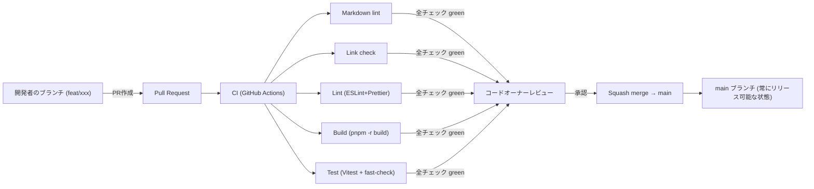
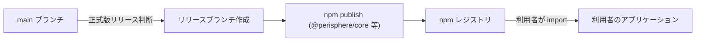

# Deployment Architecture — UoW-A コア基盤

- **関連 Issue**: [#27](https://github.com/AtsutoNakayama/perisphere/issues/27)
- **作成日**: 2026-08-03
- **前提資料**: `infrastructure-design.md`

perisphere は稼働サーバーを持たないクライアントサイドライブラリのため、一般的な「デプロイアーキテクチャ」（サーバー/クラウドリソースへの配備）は存在しない。ここでは「配布パイプライン」（ソースコード → CI 検証 → npm レジストリでの配布）を対象とする。

## 1. 全体フロー（現時点: UoW-A 完了時点）



### テキスト代替

```text
開発者のブランチ → PR作成 → CI（Markdown lint / Link check / Lint / Build / Test）
全チェック green → コードオーナーレビュー承認 → Squash merge → main
main は常にリリース可能な状態を維持する（GitHub Flow, NFR-11）
```

## 2. 将来の配布フロー（本ユニットでは未構築、参考として記載）

`requirements.md` NFR-11・NFR-07 に基づく、将来のリリース設計で構築される想定のフロー（`infrastructure-design.md` §4 の通り、実装は本ユニットのスコープ外）。



### テキスト代替

```text
main ブランチ → 正式版リリース判断 → リリースブランチ作成 → npm publish → npm レジストリ
利用者は npm レジストリから @perisphere/core / @perisphere/react を import する
（本フローの具体的なCI実装は、後続ユニットが出揃った段階のリリース設計で確定する）
```

## 3. 配布物の所在（変更なし・参考として整理）

| 成果物 | 所在 | 備考 |
|---|---|---|
| ソースコード | GitHub リポジトリ（`main` ブランチ） | Git 履歴から常に復元可能（NFR-11） |
| ビルド成果物（`.js`/`.d.ts`） | npm レジストリ（将来） | 本ユニットでは公開しない（`infrastructure-design.md` §4） |
| CI 実行結果 | GitHub Actions | ログ保持期間は GitHub 既定に従う |
| デモサイト | 静的ホスティング（将来・UoW-I） | 本ユニットのスコープ外 |

## 4. UoW-A 完了時点でのインフラ変更サマリ

| 変更対象 | 内容 |
|---|---|
| `.github/workflows/ci.yml` | `lint`/`build`/`test` ジョブを追加（`infrastructure-design.md` §2） |
| `.github/dependabot.yml`（新規） | npm + github-actions エコシステムを weekly で追跡（`infrastructure-design.md` §3） |
| `.nvmrc`（新規） | Node.js LTS バージョン固定 |
| ブランチ保護設定（GitHub リポジトリ設定） | 必須ステータスチェックへの追加は CI グリーン確認後に別途実施（`infrastructure-design.md` §6） |

npm 公開・リリースブランチ運用（§2）は本ユニットの変更サマリに含まれない（未着手）。
