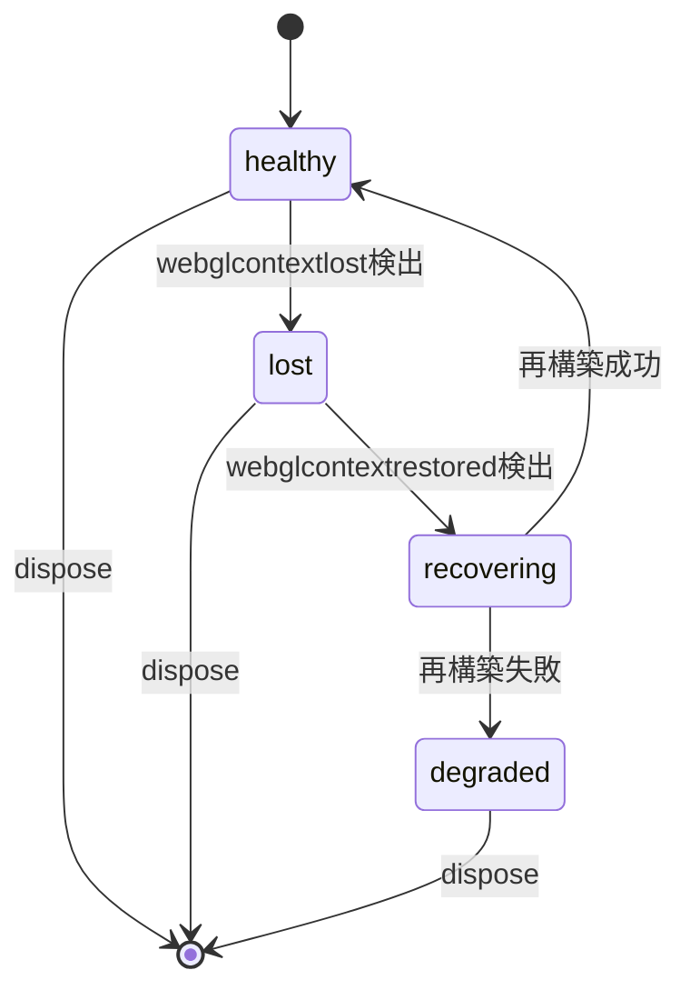
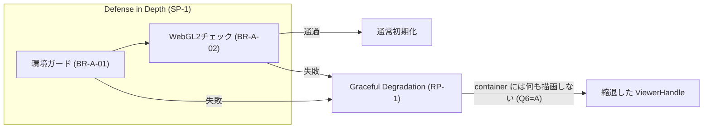
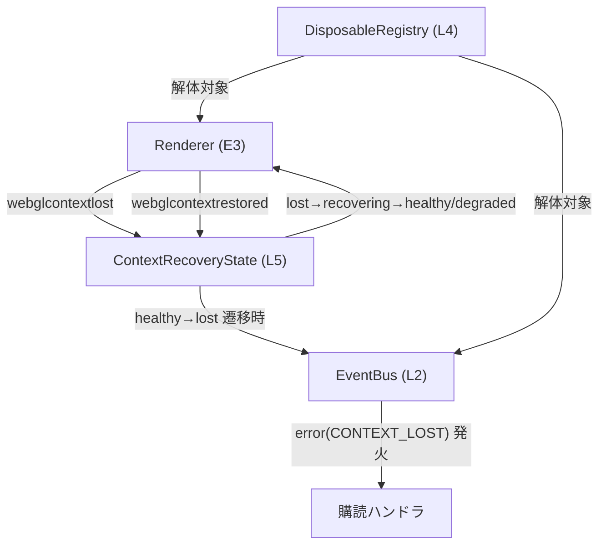

# Logical Components — UoW-A コア基盤

- **関連 Issue**: [#27](https://github.com/AtsutoNakayama/perisphere/issues/27)
- **作成日**: 2026-08-02
- **前提資料**: `uow-a-nfr-design-plan.md`、`construction/uow-a/functional-design/domain-entities.md`、`nfr-design-patterns.md`

`domain-entities.md` のエンティティに、本ステージで確定したパターン（`nfr-design-patterns.md`）を適用した論理コンポーネントとしての役割を対応付ける。E12（`ContextRecoveryState`）は本ステージで新たに導入する。

## 1. 論理コンポーネント一覧

| # | 論理コンポーネント | 対応エンティティ | 適用パターン |
|---|---|---|---|
| L1 | `ViewerHandle` | E2 | Facade（内部実装を隠蔽し契約のみ公開） |
| L2 | `EventBus` | E4 | Observer（型付き pub/sub） |
| L3 | `ViewerMode` / `StandardMode` | E8/E9 | Strategy（投影適用ロジックの差し替え可能な実装） |
| L4 | `DisposableRegistry` | E7 | Registry + Idempotent Operation（解体対象の一元管理、多重呼び出し安全） |
| L5 | `ContextRecoveryState`（新規） | E3 `Renderer` の内部状態を具体化 | State Machine（RP-2） |
| L6 | 初期化パイプライン（`createViewer` 内部） | E1 `Viewer` | Defense in Depth（SP-1）+ Graceful Degradation（RP-1） |
| L7 | `Renderer` の描画ループ | E3 | Continuous Render Loop（PP-1）+ Single-Loop Invariant（PP-3） |

## 2. L5 `ContextRecoveryState`（新規論理コンポーネント）

Functional Design の P6（コンテキストロスト検出・復帰）を、NFR Design Q2=A の決定に基づき明示的な状態機械として具体化する。

```text
type ContextRecoveryState = 'healthy' | 'lost' | 'recovering' | 'degraded';
```

### 状態遷移表

| 現在の状態 | イベント/条件 | 遷移先 | 副作用 |
|---|---|---|---|
| `healthy` | `webglcontextlost` 検出 | `lost` | 描画ループ停止、`error(CONTEXT_LOST)` 発火（BR-A-12） |
| `lost` | `webglcontextrestored` 検出 | `recovering` | リソース再構築を開始 |
| `recovering` | 再構築成功 | `healthy` | 描画ループ再開 |
| `recovering` | 再構築失敗 | `degraded` | フォールバック表示を維持（再試行しない、BR-A-12） |
| `lost` | （`webglcontextrestored` が発火しない） | （`lost` のまま） | フォールバック表示を維持 |
| `healthy`/`lost`/`degraded` | `dispose()` | （終了） | `DisposableRegistry` 経由で解体（L4） |

`recovering` は再構築処理が同期的に完了するため実行時間としては一瞬だが、状態として明示的にモデル化することで、テスト（fast-check による網羅的な状態遷移検証を含む）や将来のデバッグ・可観測性向上に利用できる（`nfr-design-patterns.md` RP-2）。

### 状態遷移図



### テキスト代替

```text
healthy --(webglcontextlost検出)--> lost
lost --(webglcontextrestored検出)--> recovering
recovering --(再構築成功)--> healthy
recovering --(再構築失敗)--> degraded
lost は webglcontextrestored が発火しない限り lost のまま留まる
healthy/lost/degraded のいずれからも dispose() で終了する
```

## 3. L6 初期化パイプライン（Defense in Depth + Graceful Degradation）

`business-logic-model.md` P1 の初期化フローを、パターンの観点で整理する。



### テキスト代替

```text
環境ガード（BR-A-01）と WebGL2チェック（BR-A-02）の2段階チェックを直列実施（多層防御 / SP-1）
いずれかで失敗 → Graceful Degradation（RP-1）へ → container には何も描画せず、縮退した ViewerHandle を返す
両方通過 → 通常初期化へ進む（business-logic-model.md P1 参照）
```

## 4. L7 描画ループ（Continuous Render Loop + Single-Loop Invariant）

- `Renderer` は `requestAnimationFrame` のハンドルを 1 つだけ保持する（多重ループを防ぐ不変条件、PP-3）。
- ループは `ContextRecoveryState`（L5）が `healthy` の間のみ実行され、`lost`/`recovering` の間は一時停止する。`degraded` に至った場合は再開しない。
- `dispose()` 時に `DisposableRegistry`（L4）経由で `cancelAnimationFrame` される（BR-A-11）。

## 5. コンポーネント間の協調（更新版シーケンス）



### テキスト代替

```text
Renderer が webglcontextlost/webglcontextrestored を検出し、ContextRecoveryState に通知する
ContextRecoveryState の healthy→lost 遷移時、EventBus 経由で error(CONTEXT_LOST) が発火される
ContextRecoveryState の遷移結果（healthy/degraded）に応じて Renderer の描画ループが制御される
DisposableRegistry は Renderer・EventBus を解体対象として保持する（既存の domain-entities.md と同じ）
```
