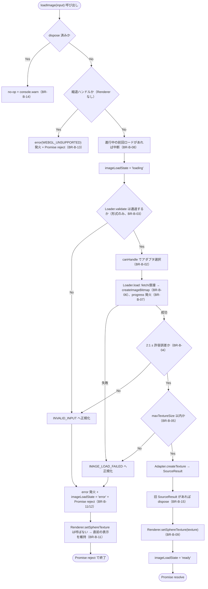
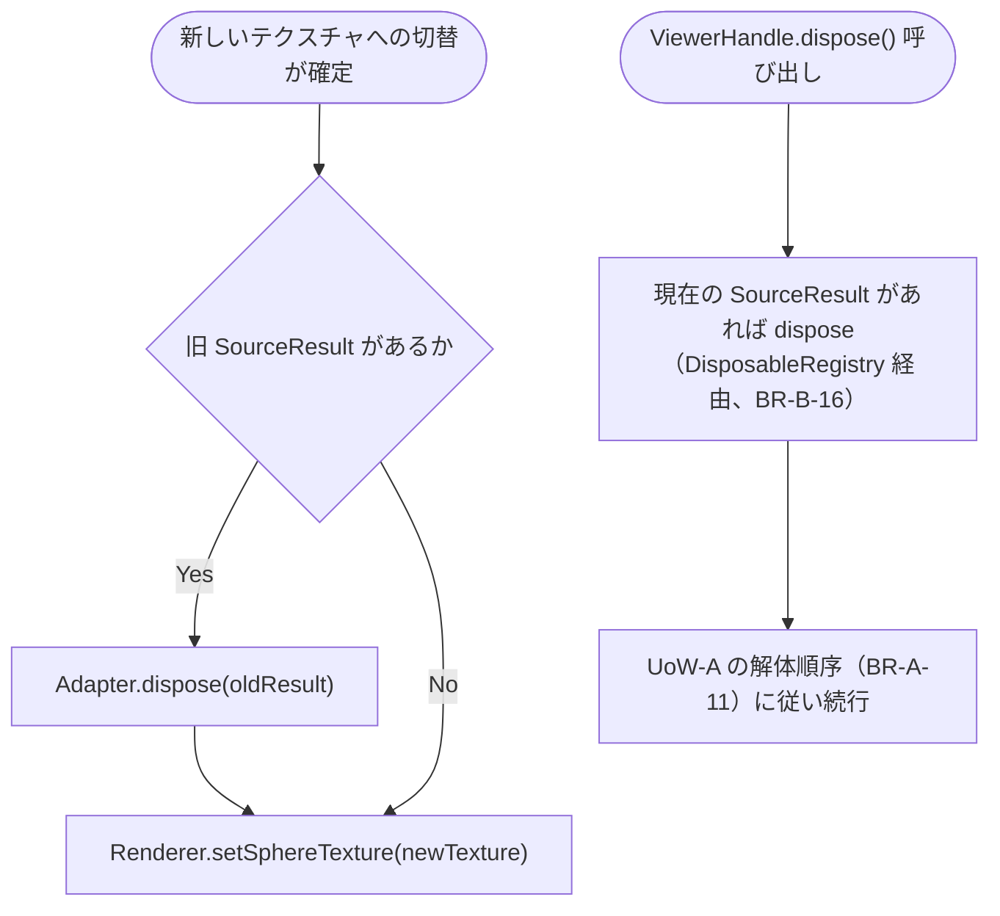

# Business Logic Model — UoW-B 画像入力・ロード

- **関連 Issue**: [#34](https://github.com/AtsutoNakayama/perisphere/issues/34)
- **作成日**: 2026-08-03
- **前提資料**: `domain-entities.md`、`business-rules.md`

## スコープと前提

UoW-B は「1 枚の画像を標準ビューで表示」という最初の縦切り到達点（`unit-of-work-dependency.md` M1+M2）のうち、**画像取得・検証・テクスチャ化（M2）** を担う。UoW-A（M1）が提供するプレースホルダ球体メッシュ・`Renderer`・`EventBus`・`ErrorManager`・`DisposableRegistry` を土台として利用する。

複数写真の管理（`next`/`prev`/`goTo`、写真切替時の `photochange`）は UoW-E（ギャラリー）の責務であり、本ユニットは単一の `loadImage` 呼び出しの一生分のみを扱う。

## プロセス一覧

| # | プロセス | 対応ストーリー | 主なルール |
|---|---|---|---|
| P1 | 画像ロード（`loadImage`） | US-01, US-02, US-03, US-32 | BR-B-01〜13 |
| P2 | 入力ソースの登録（`registerSource`） | US-04 | BR-B-02 |
| P3 | 破棄・リソース解放 | US-31 | BR-B-15, BR-B-16 |

## P1: 画像ロード（`loadImage`）

`ViewerHandle.loadImage(input)` が呼ばれてから `Promise` が解決/拒否されるまでの処理。BR-B-01〜13 を参照。



### テキスト代替

```text
1. loadImage(input) が呼ばれる
2. dispose 済みなら no-op + 警告で終了（BR-B-14）
3. 縮退ハンドル（Renderer なし）なら error(WEBGL_UNSUPPORTED) + Promise reject で終了（BR-B-13）
4. 進行中の前回ロードがあれば AbortController で中断（BR-B-08）
5. imageLoadState = 'loading'
6. Loader.validate（形式のみ）: 不正なら INVALID_INPUT へ（手順11）
7. canHandle でアダプタ選択（登録順、既定は EquirectangularSource）
8. Loader.load: fetch（URL）または直接（Blob）→ createImageBitmap。進行中 progress を発火
   失敗（404/CORS/ネットワーク/中断）→ IMAGE_LOAD_FAILED へ（手順11、ユーザー起因の中断は無視）
9. デコード後の実寸で 2:1 ± 許容誤差を検証: 範囲外なら INVALID_INPUT へ（手順11）
10. maxTextureSize 以内か検証: 超過なら IMAGE_LOAD_FAILED へ（手順11）
11. [失敗パス] error イベント発火 + imageLoadState = 'error' + Promise reject。
    Renderer.setSphereTexture は呼ばない（直前の表示を維持、BR-B-11）
12. [成功パス] Adapter.createTexture で SourceResult 生成 → 旧 SourceResult があれば dispose
    → Renderer.setSphereTexture(texture) → imageLoadState = 'ready' → Promise resolve
```

## P2: 入力ソースの登録（`registerSource`）

- `ViewerHandle.registerSource(adapter)` は、内部のアダプタ一覧の先頭側（既定の `EquirectangularSource` より前）に追加する（BR-B-02）。
- 同一 `id` のアダプタが既に登録されている場合の上書き可否は本ユニットのスコープでは規定しない（YAGNI。実運用で問題が確認された場合に個別検討）。
- 登録のみを行い、即座の再ロードは行わない（次回の `loadImage` 呼び出しから有効）。

## P3: 破棄・リソース解放



### テキスト代替

```text
新しいテクスチャへの切替時: 旧 SourceResult があれば dispose してから Renderer.setSphereTexture で反映（BR-B-15）
Viewer 全体の dispose 時: 現在の SourceResult（あれば）を DisposableRegistry 経由で解放し、
  UoW-A で確定済みの解体順序（BR-A-11: モード → Renderer → リスナー → EventBus）に組み込まれる形で実行する（BR-B-16）
```
