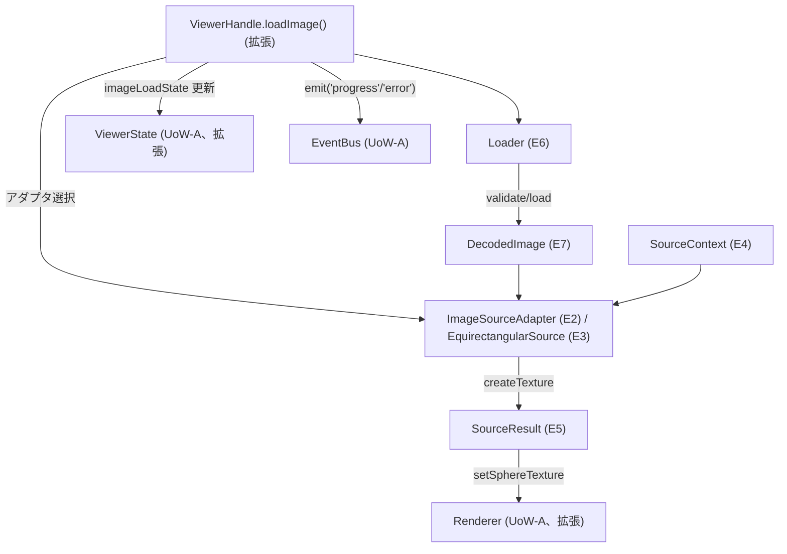

# Domain Entities — UoW-B 画像入力・ロード

- **関連 Issue**: [#34](https://github.com/AtsutoNakayama/perisphere/issues/34)
- **作成日**: 2026-08-03
- **前提資料**: `uow-b-functional-design-plan.md`（Q1〜Q8 回答）、Inception `components.md` / `component-methods.md` / `services.md`、UoW-A 実装（`packages/core/src/viewer/`）
- **注記**: 本ユニットのエンティティ番号（E1〜）はこのドキュメント内で独立採番する（UoW-A の `domain-entities.md` とは別スコープ）。UoW-A の既存型・クラスを拡張する箇所は個別に明記する。

## エンティティ一覧

| # | 名称 | 種別 | 対応 Inception コンポーネント | 概要 |
|---|---|---|---|---|
| E1 | `ImageInput` | 値オブジェクト | （`component-methods.md` 共通型） | `string`（URL）\| `Blob`（Q1=B） |
| E2 | `ImageSourceAdapter`（IF） | 公開拡張 IF | C4（IF 部分） | 画像ソース解釈の交換可能抽象。`id`/`canHandle`/`createTexture`/`dispose` |
| E3 | `EquirectangularSource` | `ImageSourceAdapter` の実装 | C4（初期実装） | 正距円筒画像の 2:1 検証とテクスチャ生成 |
| E4 | `SourceContext` | 値オブジェクト | （`createTexture` 引数型） | `{ maxTextureSize: number }`。`Renderer` の WebGL 能力値 |
| E5 | `SourceResult` | 値オブジェクト | （`createTexture` 戻り値型） | `{ texture, width, height }` |
| E6 | `Loader` | 内部エンティティ | C13 | 形式検証・取得・デコード・進行通知 |
| E7 | `DecodedImage` | 値オブジェクト | （`Loader.load` 戻り値型） | `{ bitmap: ImageBitmap; width: number; height: number }` |
| E8 | `ImageLoadState` | 値（`ViewerState` 拡張） | C12 拡張 | `'idle' \| 'loading' \| 'ready' \| 'error'`。UoW-A の `loadState` とは別概念（Q8=A） |

## 既存型・クラスへの拡張（UoW-A 実装への変更）

| 対象 | 変更内容 | 理由 |
|---|---|---|
| `ViewerEventMap`（`types.ts`） | `progress: { type: 'progress'; loaded: number; total?: number }` を追加 | Inception `component-methods.md` の `ViewerEventMap.progress` 定義、UoW-A で確立した「`type` 判別子付きイベントオブジェクト」パターンを踏襲 |
| `ViewerState`（`types.ts`） | `imageLoadState: ImageLoadState`（E8）を追加 | Q8=A。BR-A-16 の「`loadState` と画像ロード進捗は別概念」という既存決定を尊重 |
| `ViewerHandle`（`types.ts`） | `loadImage(input: ImageInput): Promise<void>` / `registerSource(adapter: ImageSourceAdapter): void` を追加 | `component-methods.md` C1 のシグネチャに対応 |
| `Renderer`（`Renderer.ts`） | `setSphereTexture(texture: Texture \| null): void` を追加 | Q7=A。`Renderer` のカプセル化を維持したままテクスチャを反映する唯一の経路 |

## エンティティ詳細

### E1 `ImageInput`

```text
type ImageInput = string | Blob;   // string は URL（US-03）、Blob はデータ直接指定（US-01, File を含む）
```

### E2 `ImageSourceAdapter`（IF）/ E3 `EquirectangularSource`

```text
interface ImageSourceAdapter {
  readonly id: string;
  canHandle(input: ImageInput): boolean;
  createTexture(decoded: DecodedImage, ctx: SourceContext): Promise<SourceResult>;
  dispose(result: SourceResult): void;
}

class EquirectangularSource implements ImageSourceAdapter {
  readonly id = 'equirectangular';
  canHandle(input: ImageInput): boolean { /* image/jpeg・image/png らしき入力かの粗い判定（BR-B-02） */ }
  async createTexture(decoded: DecodedImage, ctx: SourceContext): Promise<SourceResult> {
    /* 1. 2:1 アスペクト比検証（BR-B-04） 2. maxTextureSize 超過検証（BR-B-06） 3. THREE.Texture 生成 */
  }
  dispose(result: SourceResult): void { /* texture.dispose() */ }
}
```

**`component-methods.md` からの調整点（レビュー対象）**: Inception の擬似シグネチャは `createTexture(input: ImageInput, ctx)` だったが、Functional Design で `createTexture(decoded: DecodedImage, ctx)` に変更した。理由: 取得・デコードは `Loader`（E6、フォーマット非依存）が一括して担い、`ImageSourceAdapter` はデコード済みビットマップをテクスチャ化するフォーマット固有ロジックのみに責務を絞ることで、将来のアダプタ（キューブマップ等、UoW-B-F）が取得処理を再実装せずに済む。`component-methods.md` の注記「型名・引数は実装段階で調整されうる」の範囲内の変更。

### E4 `SourceContext`

```text
interface SourceContext {
  maxTextureSize: number;   // Renderer の WebGL2 コンテキストから取得（gl.getParameter(MAX_TEXTURE_SIZE)）
}
```

### E5 `SourceResult`

```text
interface SourceResult {
  texture: Texture;    // three.js Texture（Renderer.setSphereTexture に渡す）
  width: number;
  height: number;
}
```

### E6 `Loader`

```text
class Loader {
  validate(input: ImageInput): void;   // 形式検証のみ。不正なら INVALID_INPUT 相当の例外（BR-B-03）
  load(
    input: ImageInput,
    onProgress: (loaded: number, total?: number) => void,
    signal: AbortSignal,
  ): Promise<DecodedImage>;             // fetch（URL）または直接（Blob）→ createImageBitmap（BR-B-05）
}
```

### E7 `DecodedImage`

```text
interface DecodedImage {
  bitmap: ImageBitmap;
  width: number;
  height: number;
}
```

### E8 `ImageLoadState`

```text
type ImageLoadState = 'idle' | 'loading' | 'ready' | 'error';
```

## エンティティ関係図



### テキスト代替

```text
ViewerHandle.loadImage() が Loader.validate → Loader.load（DecodedImage 生成）を実行
loadImage が canHandle により ImageSourceAdapter（既定は EquirectangularSource）を選択
選択された Adapter.createTexture(DecodedImage, SourceContext) が SourceResult（texture）を生成
SourceResult.texture は Renderer.setSphereTexture（UoW-A Renderer への拡張メソッド）経由でのみ反映される
loadImage は進行中に progress を、失敗時に error を EventBus 経由で発火し、ViewerState.imageLoadState を更新する
```
