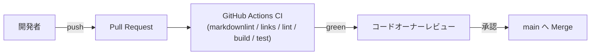

# Deployment Architecture — UoW-B 画像入力・ロード

- **関連 Issue**: [#34](https://github.com/AtsutoNakayama/perisphere/issues/34)
- **作成日**: 2026-08-03

## 現時点の配布フロー（UoW-A から変更なし）

UoW-A の `deployment-architecture.md` と同一のフロー。UoW-B によるインフラ変更はない（`infrastructure-design.md` §2 参照）。npm 公開フローは引き続き未構築（将来のリリース準備ユニット/Issue で扱う）。

## UoW-B 完了時点でのインフラ変更サマリ

なし。`packages/core/src/loader/` 配下のアプリケーションコード追加のみで、既存 CI ジョブ（`lint`/`build`/`test`）がそのままカバーする。
