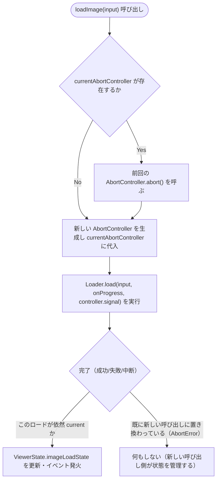
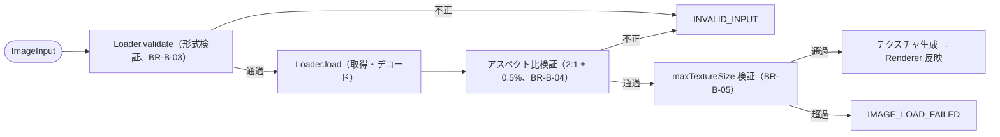
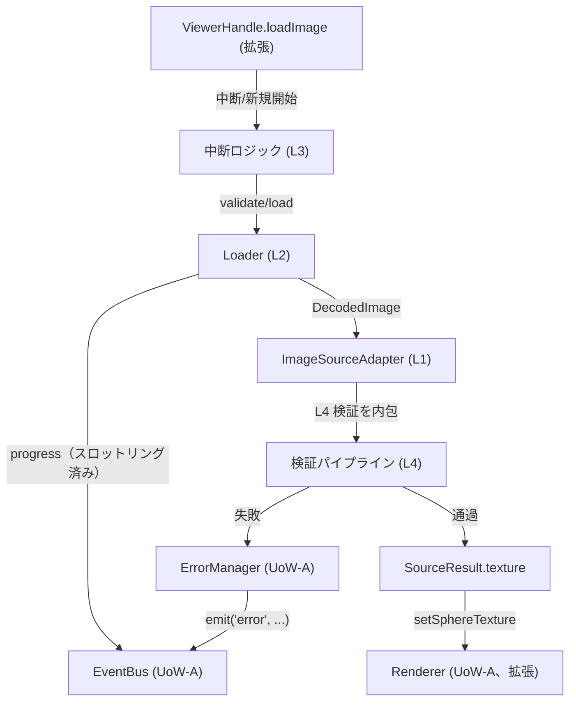

# Logical Components — UoW-B 画像入力・ロード

- **関連 Issue**: [#34](https://github.com/AtsutoNakayama/perisphere/issues/34)
- **作成日**: 2026-08-03
- **前提資料**: `uow-b-nfr-design-plan.md`、`construction/uow-b/functional-design/domain-entities.md`、`nfr-design-patterns.md`

`domain-entities.md` のエンティティに、本ステージで確定したパターン（`nfr-design-patterns.md`）を適用した論理コンポーネントとしての役割を対応付ける。UoW-A の `logical-components.md`（L1〜L7）とは独立に、本ドキュメント内で L1 から採番する。

## 1. 論理コンポーネント一覧

| # | 論理コンポーネント | 対応エンティティ | 適用パターン |
|---|---|---|---|
| L1 | `ImageSourceAdapter` / `EquirectangularSource` | E2/E3 | Strategy（フォーマット別テクスチャ化ロジックの差し替え可能な実装。UoW-A の `ViewerMode` と同じ思想） |
| L2 | `Loader` | E6 | Single-Attempt Load（RP-B-1）+ Throttled Progress Emission（PP-B-1） |
| L3 | `loadImage` 内の中断ロジック | （`createViewer.ts` 拡張、`ViewerHandle.loadImage` 実装内部） | Cancellation-over-Retry（RP-B-2）。専用の状態機械は導入せず、`currentAbortController: AbortController \| null` のローカル状態で表現（Q3=A） |
| L4 | 検証パイプライン | `Loader.validate` → `EquirectangularSource.createTexture` 内のアスペクト比/サイズ検証 | Layered Validation（SP-B-1、UoW-A SP-1 の継続） |
| L5 | テクスチャのリソース解放 | E5 `SourceResult` の dispose 連携 | UoW-A の `DisposableRegistry`（L4）を再利用。新規の解放機構は導入しない |

## 2. L2 `Loader`（Single-Attempt Load + Throttled Progress Emission）

```text
class Loader {
  validate(input: ImageInput): void;
  load(input, onProgress, signal): Promise<DecodedImage>;
    - 内部で最後の progress 発火時刻を保持し、50ms 未満の間隔での再発火を抑制する（PP-B-1）
    - fetch/デコードが失敗した場合、リトライせず即座に reject する（RP-B-1）
    - signal が abort された場合、AbortError として reject し、呼び出し元（L3）はこれをエラー通知の対象外として扱う
}
```

## 3. L3 `loadImage` の中断ロジック（Cancellation-over-Retry）



### テキスト代替

```text
loadImage が呼ばれるたびに、既存の currentAbortController があれば abort() してから新しい AbortController を生成する
Loader.load の結果が「現在の currentAbortController に対応するものか」を確認し、対応する場合のみ ViewerState/イベントを更新する
対応しない場合（既に次の呼び出しに置き換えられている）は無視する（BR-B-08 の「中断されたロードは静かに破棄される」を実現）
```

## 4. L4 検証パイプライン（Layered Validation）



### テキスト代替

```text
形式検証（validate）→ 取得・デコード → アスペクト比検証 → maxTextureSize 検証 → テクスチャ生成・反映
の順に直列実施し、いずれかで失敗すれば以降の処理を行わず対応するエラーコードで正規化する（SP-B-1）
```

## 5. L5 リソース解放（既存の `DisposableRegistry` を再利用）

- UoW-A の `DisposableRegistry`（`domain-entities.md` E7）は、`Viewer` の dispose 対象を FIFO で解体する汎用機構としてそのまま再利用する。
- `loadImage` 成功時、現在の `SourceResult` への参照を保持する変数を更新するのみで、`DisposableRegistry` への新規登録・解除操作は行わない（`DisposableRegistry` はユニット全体の dispose 時に 1 回だけ「現在の `SourceResult` があれば dispose する」というクロージャを 1 つ登録するだけで足りる。画像切替のたびに登録・解除を繰り返す必要はない）。
- 画像切替時の旧テクスチャ解放（BR-B-15）は `DisposableRegistry` を経由せず、`loadImage` の成功パス内で直接 `adapter.dispose(oldResult)` を呼ぶ（切替は "dispose ライフサイクル" ではなく "業務ロジックの一部" であるため）。

## 6. コンポーネント間の協調（更新版シーケンス）



### テキスト代替

```text
ViewerHandle.loadImage は中断ロジック（L3）経由で Loader（L2）を起動する
Loader は progress を EventBus 経由で発火しつつ DecodedImage を ImageSourceAdapter（L1）に渡す
ImageSourceAdapter は検証パイプライン（L4）を内包し、通過した場合のみ SourceResult を生成する
SourceResult.texture は Renderer.setSphereTexture（UoW-A Renderer の拡張）経由で反映される
検証パイプラインで失敗した場合は ErrorManager（UoW-A）経由で error が発火される
```
