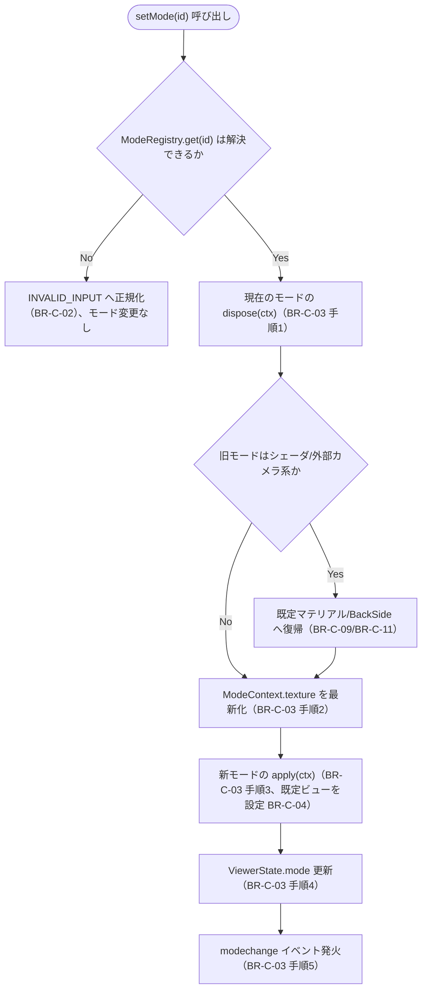
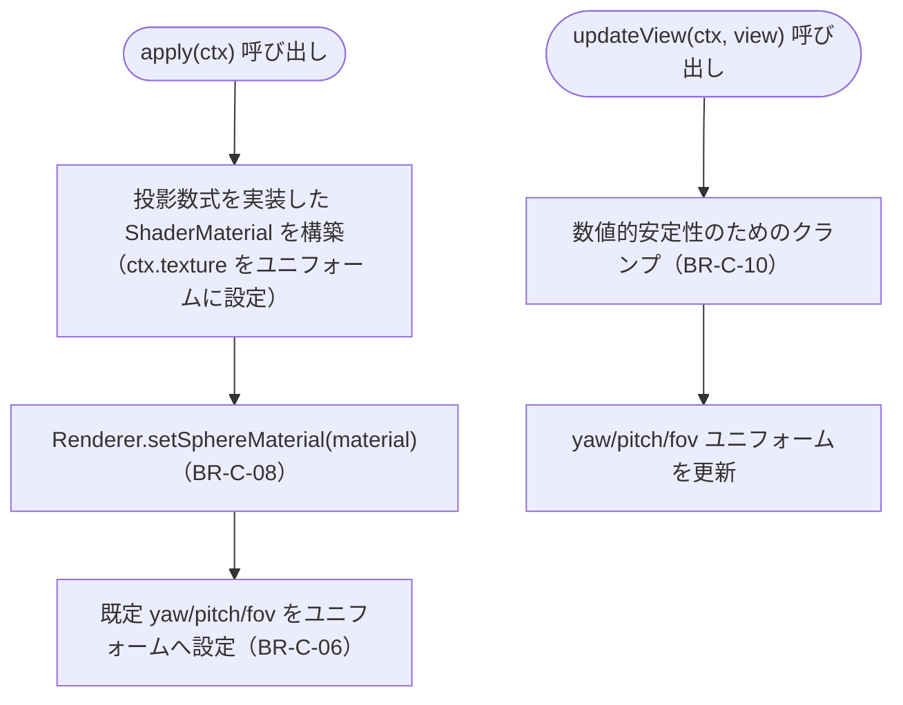

# Business Logic Model — UoW-C 投影モード

- **関連 Issue**: [#36](https://github.com/AtsutoNakayama/perisphere/issues/36)
- **作成日**: 2026-08-03
- **前提資料**: `domain-entities.md`、`business-rules.md`

## スコープと前提

UoW-C は「標準以外の 6 モードへの切替・拡張登録ができる」という到達点（M3）を担う。UoW-A（`ViewerMode` IF・`StandardMode`・`Renderer`）と UoW-B（画像テクスチャ）を土台として利用する。視点操作の実際の入力処理（マウス/タッチ/キーボード）は UoW-D の責務であり、本ユニットは「各モードが `updateView(ctx, view)` に与えられた yaw/pitch/fov を正しく描画に反映すること」までを扱う。

## プロセス一覧

| # | プロセス | 対応ストーリー | 主なルール |
|---|---|---|---|
| P1 | モード切替（`setMode`） | US-10 | BR-C-02〜04, BR-C-09, BR-C-11 |
| P2 | 初期登録 | US-12 | BR-C-01 |
| P3 | シェーダベースモードの適用 | US-07, US-08 | BR-C-06, BR-C-08, BR-C-10 |
| P4 | Crystal Ball の適用 | US-08 | BR-C-07 |

## P1: モード切替（`setMode`）



### テキスト代替

```text
1. setMode(id) が呼ばれる
2. ModeRegistry.get(id) で解決を試みる: 失敗 → INVALID_INPUT へ正規化しモードは変更しない（BR-C-02）
3. 成功: 現在のモードの dispose(ctx) を呼ぶ（シェーダ系ならマテリアルを既定へ、Crystal Ball なら BackSide へ復帰）
4. ModeContext.texture を最新のテクスチャで更新する
5. 新モードの apply(ctx) を呼ぶ（既定ビューを設定、BR-C-04）
6. ViewerState.mode を更新し、modechange イベントを発火する
```

## P2: 初期登録

`createViewer` 初期化時、`ModeRegistry` に 7 モード（`StandardMode` を含む）を登録してから初期化パイプライン（UoW-A BR-A-05）を継続する。

```text
1. ModeRegistry を生成
2. StandardMode, UltraWideMode, LinearMode, DewarpMode, PaniniMode, TinyPlanetMode, CrystalBallMode を register する
3. ModeRegistry.get('standard') で StandardMode を取得し、UoW-A の初期化順序（BR-A-05）に従って適用する
```

## P3: シェーダベースモードの適用（Dewarp/Panini/Tiny Planet）



### テキスト代替

```text
apply(ctx): 投影数式を実装した ShaderMaterial を構築し（ctx.texture をユニフォームとして渡す）、
  Renderer.setSphereMaterial 経由で球体メッシュへ適用し、既定ビューのユニフォームを設定する
updateView(ctx, view): 発散しうる角度をクランプしたうえで yaw/pitch/fov ユニフォームを更新する
```

## P4: Crystal Ball の適用

```text
apply(ctx):
  1. ctx.camera の position を球中心から半径の 2.5 倍の距離へ移動する
  2. ctx.sphereMesh.material.side を FrontSide に切り替える
  3. 既定 yaw/pitch/fov をカメラへ設定する（BR-C-07）

updateView(ctx, view):
  カメラの向き（yaw/pitch）と fov を通常のカメラベースモードと同様に更新する
  （カメラ position は apply 時に設定した外部位置のまま変更しない）

dispose(ctx):
  ctx.sphereMesh.material.side を BackSide へ戻す（BR-C-11）。
  カメラ position の復帰は次に適用されるモードの apply が担う（各モードが自身の想定位置を設定するため）
```
