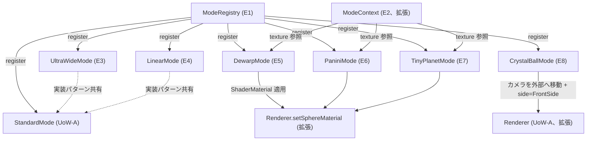

# Domain Entities — UoW-C 投影モード

- **関連 Issue**: [#36](https://github.com/AtsutoNakayama/perisphere/issues/36)
- **作成日**: 2026-08-03
- **前提資料**: `uow-c-functional-design-plan.md`（Q1〜Q6 回答）、UoW-A `domain-entities.md`（E8 `ViewerMode` IF / E9 `StandardMode` / E10 `ModeContext`）
- **注記**: 本ユニットのエンティティ番号（E1〜）はこのドキュメント内で独立採番する。投影数式は概念レベルの記述とし、GLSL 等の実装詳細は Code Generation で確定する（`component-methods.md` の「型名・引数は実装段階で調整されうる」注記の範囲内）。

## エンティティ一覧

| # | 名称 | 種別 | 実装方式（Q1） | 概要 |
|---|---|---|---|---|
| E1 | `ModeRegistry` | 内部エンティティ | — | `id` → `ViewerMode` の登録簿（Q6） |
| E2 | `ModeContext`（拡張） | 値オブジェクト（UoW-A E10 の拡張） | — | `texture: Texture \| null` を追加（Q2） |
| E3 | `UltraWideMode` | `ViewerMode` の実装 | カメラベース | 広い既定 FOV・ズーム範囲。`StandardMode` と同一の透視投影 |
| E4 | `LinearMode` | `ViewerMode` の実装 | カメラベース | 狭い既定 FOV・ズーム範囲。直線性を強調 |
| E5 | `DewarpMode` | `ViewerMode` の実装 | シェーダベース | 等距離図法（Equidistant）に基づく広視野・低歪み投影 |
| E6 | `PaniniMode` | `ViewerMode` の実装 | シェーダベース | Panini 図法の近似式に基づく広視野・垂直線保持投影 |
| E7 | `TinyPlanetMode` | `ViewerMode` の実装 | シェーダベース | ステレオ図法（Stereographic）に基づく「小惑星」投影 |
| E8 | `CrystalBallMode` | `ViewerMode` の実装 | 外部カメラ | カメラを球外部に配置し `FrontSide` で外側から眺める |

## エンティティ詳細

### E1 `ModeRegistry`（Q6=A）

```text
class ModeRegistry {
  register(mode: ViewerMode): void;         // 同一 id は上書き
  get(id: string): ViewerMode | undefined;
  has(id: string): boolean;
}
```

- **責務**: `id` による一意なモード解決（US-12）。同梱 7 モード（`StandardMode` を含む）は `createViewer` 初期化時にすべて `register` される。
- **`setMode` との関係**: `ViewerHandle.setMode(id)` は `ModeRegistry.get(id)` で解決できない場合、UoW-A の BR-A-17 と同様 `INVALID_INPUT` として扱う（本ユニットでの拡張: `'standard'` 以外の全 `id` が有効になる）。

### E2 `ModeContext`（拡張、Q2=A）

```text
interface ModeContext {
  camera: PerspectiveCamera;
  scene: Scene;
  sphereMesh: Mesh;
  texture: Texture | null;   // 新規追加。現在表示中のテクスチャ（UoW-B `SourceResult.texture` 相当）
}
```

`Renderer` が `apply`/`updateView`/`dispose` 呼び出し時にこのフィールドへ現在のテクスチャを反映する（UoW-B で導入された `currentSource` の参照を `Renderer` 経由で渡す形。具体的な配線は Code Generation で確定）。

### E3 `UltraWideMode` / E4 `LinearMode`（カメラベース、Q1=A①）

`StandardMode`（UoW-A E9）と同じ実装パターン（`apply`/`updateView` でカメラの `rotation`/`fov` を設定）。既定値のみ異なる。

| モード | 既定 FOV | 既定ズーム範囲 | 意図（US-07） |
|---|---|---|---|
| Standard（既存） | 75° | 30〜90° | 基準 |
| UltraWide | 100° | 60〜120° | 広視野・周辺歪み許容 |
| Linear | 50° | 20〜70° | 直線性重視（歪み最小化） |

### E5 `DewarpMode`（シェーダベース、Q1=A②）

- **投影方式**: 等距離図法（Equidistant / f-θ 投影）。中心からの角度 θ に比例してスクリーン半径が増加する（`r = θ / (FOV/2)`、正規化済み）。透視投影と異なり θ が 90° を超えても連続的に描画できるため、広視野でも周辺の伸びが穏やかになる（US-07「広視野で歪み軽減」）。
- **既定 FOV**: 140°。既定ズーム範囲: 90〜160°。

### E6 `PaniniMode`（シェーダベース、Q1=A②）

- **投影方式**: Panini 図法の近似式（パラメータ d ≈ 1）。水平方向は Panini 式で広角を確保しつつ、垂直方向は直線性を保つよう補正する（US-07「広視野かつ垂直線の直線性を保つ」）。
- **既定 FOV**: 120°。既定ズーム範囲: 80〜150°。

### E7 `TinyPlanetMode`（シェーダベース、Q1=A②）

- **投影方式**: ステレオ図法（Stereographic）。現在の視点方向（yaw/pitch）を投影の中心軸とし、そこからの角距離 θ に対し `r = 2·tan(θ/2)` でスクリーン半径を求める（US-08「球全体が小さな惑星状に見える」）。
- **既定 FOV**: 160°（ほぼ全天球を一枚に収める）。既定ズーム範囲: 100〜180°。

### E8 `CrystalBallMode`（外部カメラ、Q1=A③・Q4=A）

- **配置**: カメラを球中心から半径の 2.5 倍の距離へ移動し、球体メッシュのマテリアルの `side` を `FrontSide` に切り替える（他モード共通の `BackSide` から変更）。
- **視点操作**: yaw/pitch はカメラの向き（球を見る角度）に、fov は通常のズームに対応する既存のカメラベース実装を踏襲する。
- **既定 FOV**: 75°（Standard と同じ）。既定ズーム範囲: 30〜90°。

## エンティティ関係図



### テキスト代替

```text
ModeRegistry は StandardMode（UoW-A）を含む全7モードを id で管理する
UltraWideMode/LinearMode は StandardMode と同じカメラベース実装パターンを共有する（既定値のみ異なる）
DewarpMode/PaniniMode/TinyPlanetMode は Renderer.setSphereMaterial（拡張）経由で専用 ShaderMaterial を適用し、
  ModeContext.texture（拡張）をシェーダのユニフォームとして利用する
CrystalBallMode は Renderer（拡張）を通じてカメラを球外部へ移動し、マテリアルの面を反転する
```
