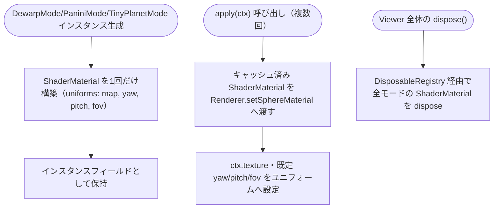
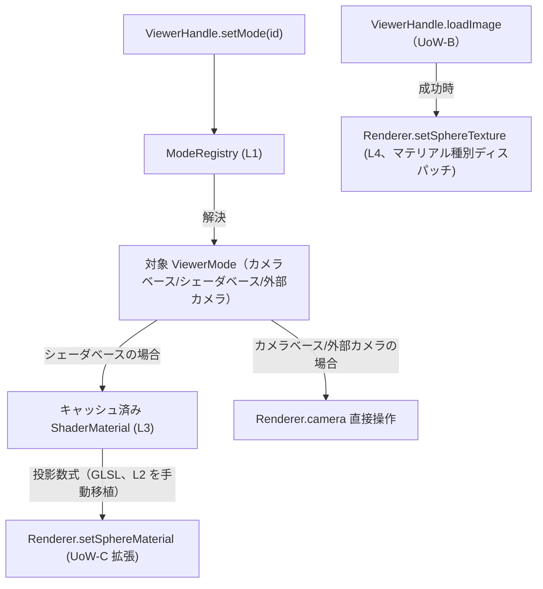

# Logical Components — UoW-C 投影モード

- **関連 Issue**: [#36](https://github.com/AtsutoNakayama/perisphere/issues/36)
- **作成日**: 2026-08-03
- **前提資料**: `uow-c-nfr-design-plan.md`、`construction/uow-c/functional-design/domain-entities.md`、`nfr-design-patterns.md`

## 1. 論理コンポーネント一覧

| # | 論理コンポーネント | 対応エンティティ | 適用パターン |
|---|---|---|---|
| L1 | `ModeRegistry` | E1 | Registry（`id` による一意解決、UoW-B の `DisposableRegistry` 等と同系統の思想） |
| L2 | 投影数式モジュール（`modes/projections/`） | （新規、E5〜E7 が利用） | テスト可能な純粋関数への分離（NFR Requirements Q1） |
| L3 | シェーダベースモードの `ShaderMaterial` | E5/E6/E7 | Per-Mode Caching（PP-C-2） |
| L4 | `Renderer.setSphereTexture`（拡張） | UoW-B `Renderer` の拡張 | マテリアル種別によるディスパッチ（NFR Requirements Q2） |
| L5 | `CrystalBallMode` のカメラ配置 | E8 | 外部カメラ配置（Q1=A③） |

## 2. L2 投影数式モジュール（テスト可能な純粋関数）

```text
// packages/core/src/modes/projections/equidistant.ts
export function equidistantRadius(theta: number, halfFov: number): number;

// packages/core/src/modes/projections/panini.ts
export function paniniProject(thetaH: number, d: number): { s: number };

// packages/core/src/modes/projections/stereographic.ts
export function stereographicRadius(theta: number): number;
```

各関数は角度（ラジアン）を受け取り、正規化されたスクリーン半径またはオフセットを返す。GLSL 側は同じ数式を手動移植するが、TS 関数はテスト（fast-check）で以下の不変条件を検証する:

- 有効角度範囲内で常に有限の値を返す（`NaN`/`Infinity` にならない）
- 角度 0（画面中心）で半径 0 を返す
- 角度の増加に対して単調に増加する（投影として意味を持つための最低条件）

## 3. L3 `ShaderMaterial` のキャッシュ（Per-Mode Caching）



### テキスト代替

```text
シェーダベースモードは ShaderMaterial をインスタンス生成時に1回だけ構築しキャッシュする
apply() のたびに再構築せず、キャッシュ済みインスタンスを Renderer.setSphereMaterial へ渡す
Viewer 全体の dispose() 時にのみ、DisposableRegistry 経由で全モードの ShaderMaterial を解放する
```

## 4. L4 `Renderer.setSphereTexture` のマテリアル種別ディスパッチ

```text
setSphereTexture(texture: Texture | null): void {
  現在の sphereMesh.material が MeshBasicMaterial なら material.map = texture
  現在の sphereMesh.material が ShaderMaterial なら material.uniforms.map.value = texture
}
```

シェーダベースモードの `ShaderMaterial` は、テクスチャユニフォームを必ず `uniforms.map` という名前で公開する規約とする（`nfr-requirements.md` Q2）。

## 5. L5 `CrystalBallMode` の外部カメラ配置

```text
apply(ctx): camera.position を球中心から半径 × 2.5 の距離へ移動、sphereMesh.material.side = FrontSide
dispose(ctx): sphereMesh.material.side = BackSide へ復帰（カメラ位置の復帰は次モードの apply が担う）
```

## 6. コンポーネント間の協調（更新版シーケンス）



### テキスト代替

```text
setMode(id) は ModeRegistry（L1）で対象モードを解決する
シェーダベースモードはキャッシュ済み ShaderMaterial（L3、投影数式は L2 の GLSL 移植）を Renderer.setSphereMaterial へ渡す
カメラベース/外部カメラのモードは Renderer.camera を直接操作する（UoW-A StandardMode と同じパターン）
loadImage（UoW-B）成功時のテクスチャ反映は Renderer.setSphereTexture（L4）がマテリアル種別を判定して行う
```
