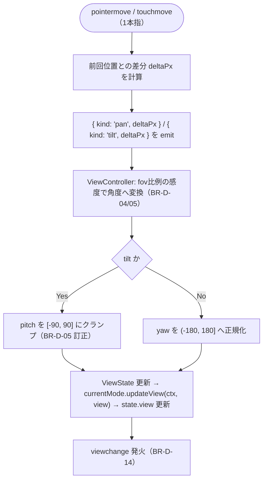
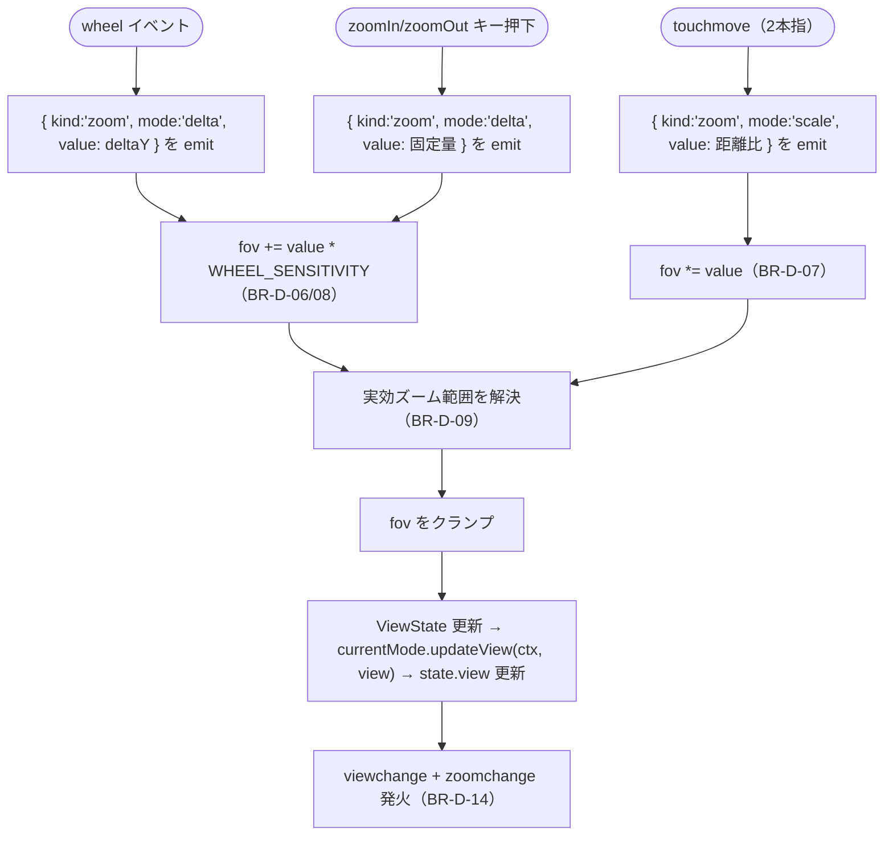
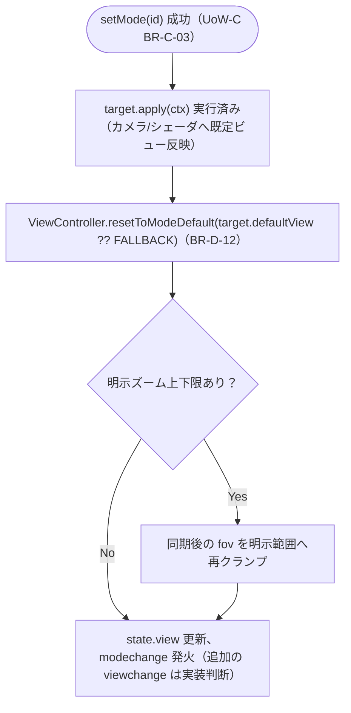

# Business Logic Model — UoW-D 視点操作・入力

- **関連 Issue**: [#38](https://github.com/AtsutoNakayama/perisphere/issues/38)
- **作成日**: 2026-08-03
- **前提資料**: `domain-entities.md`、`business-rules.md`

## スコープと前提

UoW-D は「マウス/タッチ/キーボードで視点（yaw/pitch/fov）を操作でき、ズーム範囲とキーマップを利用側が調整できる」という到達点（M4）を担う。UoW-A（`Renderer`/`ViewerState`/`EventBus`）と UoW-C（`ViewerMode`/`ModeRegistry`/`setMode`）を土台として利用する。写真送り（UoW-E）・フルスクリーン切替（UoW-F）の実処理は本ユニットの責務外だが、それらへ渡すべき `InputIntent` の正規化までは本ユニットで完結させる（BR-D-16）。

## プロセス一覧

| # | プロセス | 対応ストーリー | 主なルール |
|---|---|---|---|
| P1 | 入力源の初期化 | US-13〜19 | BR-D-01〜03 |
| P2 | パン・チルト（ドラッグ） | US-13, US-15 | BR-D-04, BR-D-05 |
| P3 | ズーム（ホイール・ピンチ・キーボード） | US-14, US-16, US-17 | BR-D-06〜09 |
| P4 | 明示 API（`setView`/`setZoomLimits`） | US-19, US-20 | BR-D-10, BR-D-11 |
| P5 | モード切替との統合 | US-20 | BR-D-12 |
| P6 | コンテキストロスト復帰との統合 | US-37 | BR-D-13 |

## P1: 入力源の初期化

```text
1. createViewer 初期化パイプライン（UoW-A BR-A-05）の一部として InputManager を生成する
2. PointerInputSource, TouchInputSource, KeyboardInputSource をコンテナへ attach する（BR-D-01）
   共有の intent ハンドラ（P2〜P5 の入口）を全ソースへ渡す
3. registerInputSource(source) 呼び出し時、同じコンテナ・同じハンドラで source.attach() する（BR-D-02）
4. dispose() 時、InputManager.detachAll() が全ソースの detach() を呼ぶ（BR-D-03）
```

## P2: パン・チルト（ドラッグ）



### テキスト代替

```text
1. pointermove（PointerInputSource）または touchmove（TouchInputSource、1本指）ごとに
   直前位置との差分 deltaPx を計算する
2. 水平差分は { kind: 'pan', deltaPx }、垂直差分は { kind: 'tilt', deltaPx } として emit する
3. ViewController が現在の fov に比例した感度係数で角度（度）へ変換する（BR-D-04/05）
4. tilt の場合、結果の pitch を [-90, 90] にクランプする（BR-D-05 訂正: ジンバルロックは実際には発生しないが、
   TinyPlanetMode の既定 pitch=-90 を許容するため境界値 90° 自体は許容する）
   pan の場合、結果の yaw を (-180, 180] へ正規化する（クランプはしない）
5. ViewState を更新し、currentMode.updateView(ctx, view) を呼んで描画へ反映、state.view を更新する
6. viewchange イベントを発火する（頻度は保証しない、BR-D-14）
```

## P3: ズーム（ホイール・ピンチ・キーボード）



### テキスト代替

```text
1. wheel（加算）/ pinch（乗算）/ キーボードの zoomIn・zoomOut（加算）のいずれかで zoom intent が emit される
2. ViewController が fov を加算（wheel・キーボード、BR-D-06/08）または乗算（pinch、BR-D-07）で更新する
3. 実効ズーム範囲（明示設定 > アクティブモードの defaultZoomLimits > 絶対フォールバック、BR-D-09）でクランプする
4. ViewState を更新し、currentMode.updateView(ctx, view) を呼んで描画へ反映、state.view を更新する
5. viewchange と zoomchange の両方を発火する（頻度は保証しない、BR-D-14）
```

## P4: 明示 API（`setView` / `setZoomLimits`）

```text
setView(partial):
  1. 現在の ViewState に partial をマージする
  2. P2/P3 と同じクランプ規則を適用する（pitch, fov, yaw 正規化）
  3. ViewState 更新 → currentMode.updateView(ctx, view) → state.view 更新 → viewchange/zoomchange 発火

setZoomLimits(partial):
  1. 現在の実効ズーム範囲（BR-D-09）に partial をマージし、以後の「明示設定」として保持する
  2. 現在の fov が新しい範囲外なら直ちにクランプする
  3. fov に変化があれば viewchange/zoomchange を発火する（BR-D-10）

setKeymap(map | null):
  1. map が null の場合、KeyboardInputSource を無効化する（全キー無視）
  2. map が Partial<Keymap> の場合、既定キーマップへマージする（空配列 [] のアクションは無効化）
```

## P5: モード切替との統合



### テキスト代替

```text
1. setMode(id) が UoW-C の手順（BR-C-03）で新モードの apply(ctx) まで完了する
2. ViewController.resetToModeDefault が呼ばれ、target.defaultView（省略時はフォールバック）へ
   ViewController の内部状態を同期する（BR-D-12）
3. 明示的なズーム上下限（setZoomLimits で設定済み）がある場合、同期後の fov をその範囲へ再クランプする
   （モードの既定 fov が利用側の明示設定を上書きしないようにする、Q5 の意図を実現する）
4. state.view を更新する。modechange は UoW-C の通り発火する。追加の viewchange 発火は実装判断
   （同一操作からの二重通知を避けたい場合は modechange のみでよい）
```

## P6: コンテキストロスト復帰との統合

```text
1. WebGL コンテキストが復帰し、Renderer.rebuild() が activeMode.apply(ctx) を呼ぶ
   （この時点でカメラ/シェーダはモード既定ビューに戻っている、UoW-A BR-A-12）
2. onRebuildSucceeded コールバック内で、currentMode.updateView(ctx, viewController.getView()) を呼ぶ
   （ViewController は復帰の前後を通じて ViewState を保持し続けているため、直前の値がそのまま使える）
3. これにより、コンテキストロスト復帰後も利用者が操作していた視点（yaw/pitch/fov）が維持される（BR-D-13）
```
