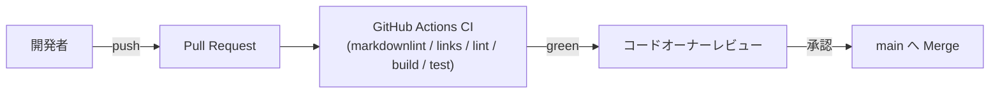

# Deployment Architecture — UoW-D 視点操作・入力

- **関連 Issue**: [#38](https://github.com/AtsutoNakayama/perisphere/issues/38)
- **作成日**: 2026-08-03

## 現時点の配布フロー（UoW-A〜C から変更なし）

UoW-A〜C の `deployment-architecture.md` と同一のフロー。UoW-D によるインフラ変更はない。npm 公開フローは引き続き未構築。

## UoW-D 完了時点でのインフラ変更サマリ

なし。`packages/core/src/interaction/` 配下のアプリケーションコード追加のみで、既存 CI ジョブ（`lint`/`build`/`test`）がそのままカバーする。
