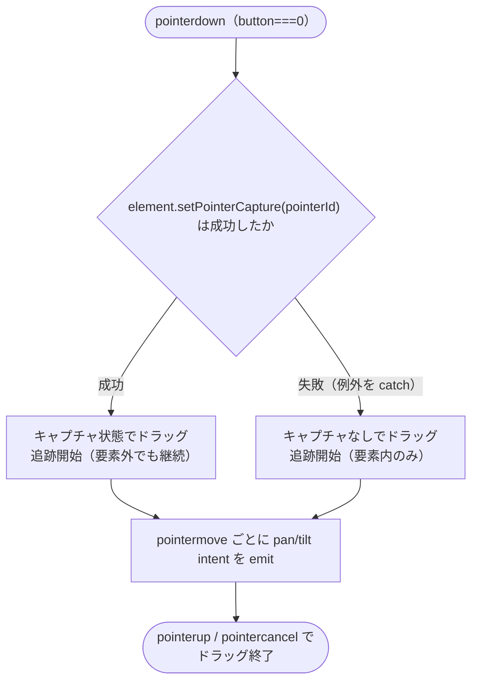
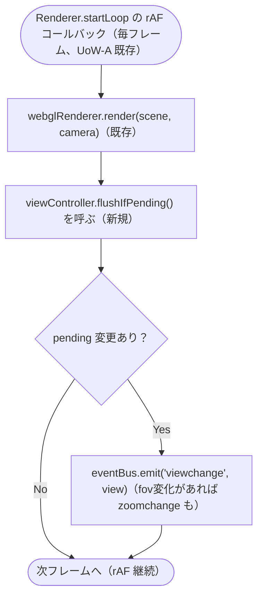
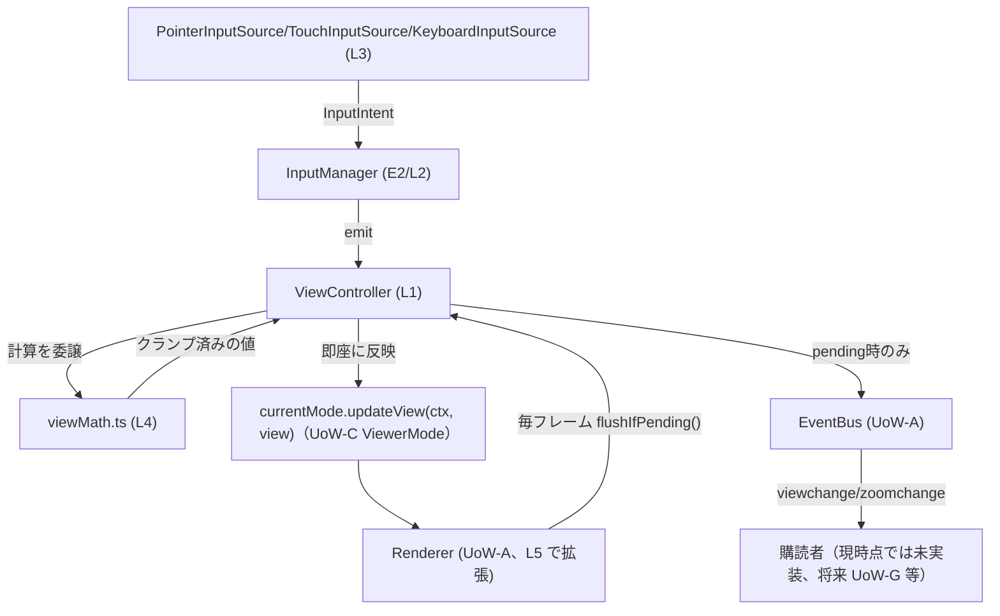

# Logical Components — UoW-D 視点操作・入力

- **関連 Issue**: [#38](https://github.com/AtsutoNakayama/perisphere/issues/38)
- **作成日**: 2026-08-03
- **前提資料**: `uow-d-nfr-design-plan.md`、`construction/uow-d/functional-design/domain-entities.md`、`nfr-design-patterns.md`

`domain-entities.md` のエンティティに、本ステージで確定したパターン（`nfr-design-patterns.md`）を適用した論理コンポーネントとしての役割を対応付ける。UoW-A/B/C の `logical-components.md`（各ユニット独立採番）とは独立に、本ドキュメント内で L1 から採番する。

## 1. 論理コンポーネント一覧

| # | 論理コンポーネント | 対応エンティティ | 適用パターン |
|---|---|---|---|
| L1 | `ViewController` | E1 | Coalesced View Change Emission（PP-D-1）の pending フラグ保持。計算自体は L4 へ委譲 |
| L2 | `InputManager` | E2 | 新規パターンなし（IF 集約のみ、`domain-entities.md` E2 の通り） |
| L3 | `PointerInputSource`/`TouchInputSource`/`KeyboardInputSource` | E4〜E6 | `PointerInputSource` に Graceful Pointer Capture Fallback（RP-D-1） |
| L4 | `viewMath.ts`（純粋関数モジュール） | （新規、`business-rules.md` BR-D-04〜09 の計算式） | PBT 対象の切り出し（NFR Design Q4、UoW-C `modes/projections/` と同型） |
| L5 | `Renderer` 描画ループへの統合（拡張） | UoW-A `Renderer` | Coalesced View Change Emission（PP-D-1）の発火チェック地点 |

## 2. L1 `ViewController`（Coalesced View Change Emission の状態保持）

```text
class ViewController {
  private view: ViewState;               // ミュータブル（NFR Requirements Q2）
  private explicitZoomLimits: ZoomLimits | null;
  private pendingNotify: boolean = false; // PP-D-1

  applyPan(deltaPx): void {
    this.view.yaw = viewMath.normalizeYaw(...);  // L4 へ委譲
    this.pendingNotify = true;
  }
  // applyTilt/applyZoomDelta/applyZoomScale/setView/setZoomLimits/resetToModeDefault も同様に
  // view を更新し pendingNotify = true とするのみで、EventBus へは直接発火しない

  flushIfPending(): { view: ViewState; fovChanged: boolean } | null {  // L5 から毎フレーム呼ばれる
    if (!this.pendingNotify) return null;
    this.pendingNotify = false;
    return { view: { ...this.view }, fovChanged: /* 直前発火時との比較 */ };
  }

  getView(): ViewState { return { ...this.view }; }  // 呼び出しごとに浅いコピー（NFR Requirements Q2）
}
```

- **設計意図**: `apply*`/`setView`/`setZoomLimits` はいずれも「計算 + `pendingNotify` フラグを立てる」だけで完結し、`EventBus.emit` を直接呼ばない。実際の発火は L5（`Renderer` の描画ループ）が毎フレーム `flushIfPending()` を呼ぶことで行われる。

## 3. L3 `PointerInputSource`（Graceful Pointer Capture Fallback）



### テキスト代替

```text
pointerdown（主ボタン）で setPointerCapture を試みる
  成功: 要素外に出てもドラッグ追跡を継続する
  失敗（try/catchで捕捉、RP-D-1）: 要素内でのみ追跡する劣化状態で続行し、例外は伝播させない
どちらの場合も pointermove ごとに pan/tilt intent を emit する
```

## 4. L4 `viewMath.ts`（PBT 対象の純粋関数モジュール）

```text
// packages/core/src/interaction/viewMath.ts
function normalizeYaw(yaw: number): number;               // (-180, 180] へ正規化（BR-D-04）
function clampPitch(pitch: number): number;                // [-90, 90]（BR-D-05、Code Generation 時点で訂正）
function clampFov(fov: number, limits: ZoomLimits): number; // 実効ズーム範囲でクランプ（BR-D-09）
function applyPanDelta(yaw: number, deltaPx: number, currentFov: number): number;   // BR-D-04
function applyTiltDelta(pitch: number, deltaPx: number, currentFov: number): number; // BR-D-05
function applyZoomAdd(fov: number, rawDeltaY: number): number;    // BR-D-06/08（加算）
function applyZoomScale(fov: number, ratio: number): number;      // BR-D-07（乗算）
function mergeKeymap(base: Keymap, partial: Partial<Keymap> | null): Keymap | null; // Keymap マージ規則
```

- `ViewController`（L1）はこれらの関数を呼び出して `this.view`/`this.explicitZoomLimits` を更新するのみで、計算式自体は持たない。
- `nfr-requirements.md` §3（PBT の適用対象）で確定した4つの不変条件（yaw 正規化・pitch クランプ・fov クランプ・`Keymap` マージ）は、このモジュールの各関数に1対1で対応する。

## 5. L5 `Renderer` 描画ループへの統合（拡張、PP-D-1）



### テキスト代替

```text
Renderer.startLoop の既存 rAF コールバック内、webglRenderer.render の呼び出しに続けて
viewController.flushIfPending() を呼ぶ（新規追加のチェック1つ）
pending 変更があれば、その時点の最新 ViewState で viewchange を発火する（fov が変化していれば zoomchange も）
pending 変更がなければ何もせず次フレームへ進む
専用の独立した rAF ループは追加しない（既存ループへの相乗り、NFR Design Q2）
```

## 6. コンポーネント間の協調（更新版シーケンス）



### テキスト代替

```text
InputSource（L3）が InputIntent を emit し、InputManager（L2）経由で ViewController（L1）が受け取る
ViewController は viewMath（L4）へ計算を委譲し、クランプ済みの新しい ViewState を得る
ViewController は currentMode.updateView(ctx, view) を即座に呼び、カメラ/シェーダへ反映する（描画の滑らかさを担保）
EventBus への viewchange/zoomchange 発火は、Renderer の描画ループ（L5）が毎フレーム
  ViewController.flushIfPending() を呼ぶことで pending 時のみ行われる（PP-D-1）
```
