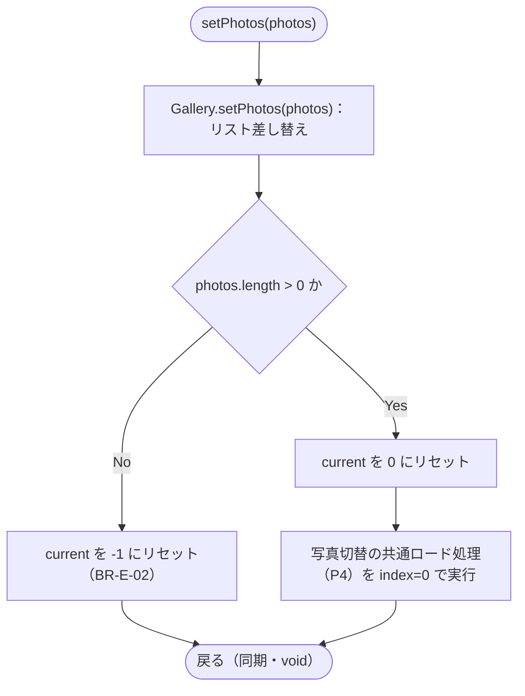
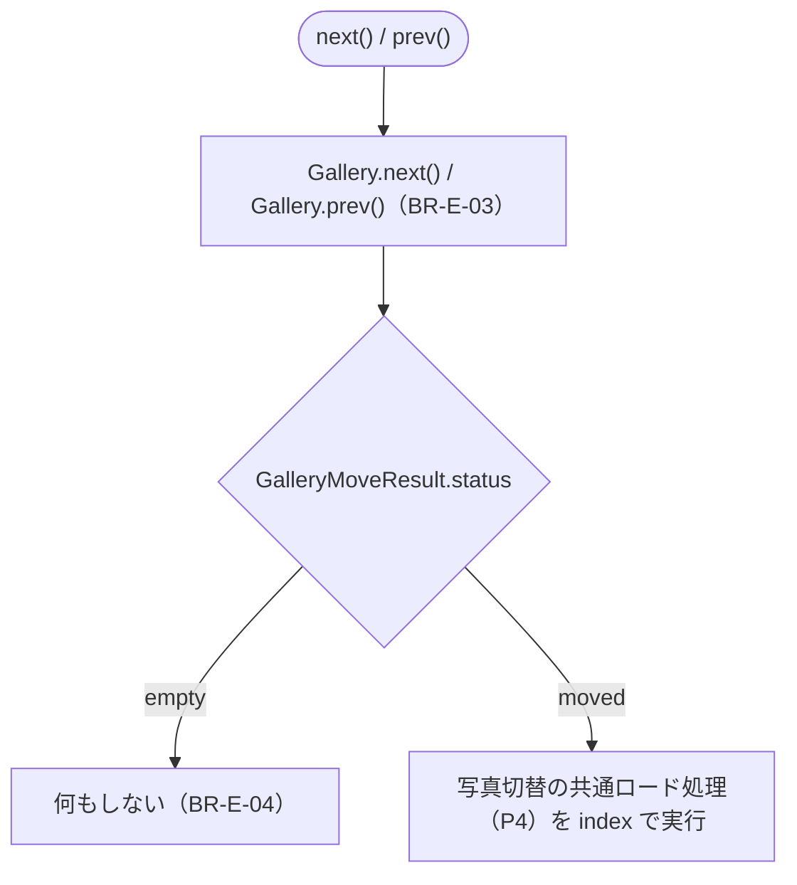
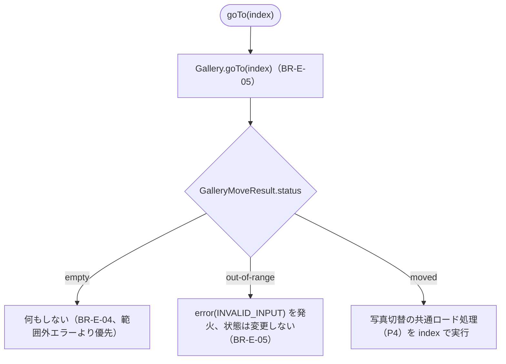
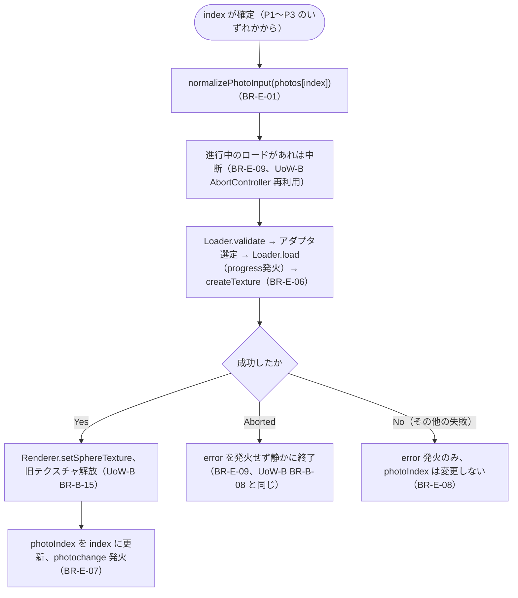

# Business Logic Model — UoW-E ギャラリー

- **関連 Issue**: [#40](https://github.com/AtsutoNakayama/perisphere/issues/40)
- **作成日**: 2026-08-03
- **前提資料**: `domain-entities.md`、`business-rules.md`

## スコープと前提

UoW-E は「複数写真のリストを設定し、`next`/`prev`/インデックス指定で切り替えられる」という到達点（M5）を担う。UoW-A（`EventBus`/`ViewerState`）を状態保持・通知の基盤とし、UoW-B の画像ロードパイプライン（`Loader`/`ImageSourceAdapter`/テクスチャ反映）を写真切替のたびに再利用する。UoW-D で先行実装された `photoNext`/`photoPrev` インテントの正規化・キーマップ（`PageUp`/`PageDown`）は本ユニットで初めて実際の切替処理に結線される。標準ギャラリー UI（サムネイル・インジケーター）自体の実装は UoW-G の責務範囲。

**`current`（目標ポインタ）と `photoIndex`（表示中ポインタ）の分離（`business-rules.md` BR-E-13）**: 以下の P2/P3 の「`Gallery.next()`/`prev()`/`goTo()` を呼ぶ」ステップは、ロードの成否を待たずその場でポインタを前進させる。P4 の「成功時に `photoIndex` を更新」ステップだけが `getPhotoIndex()` の返り値に反映される。

## プロセス一覧

| # | プロセス | 対応ストーリー | 主なルール |
|---|---|---|---|
| P1 | `setPhotos()`（初期化＋自動ロード） | US-23 | BR-E-01, BR-E-02, BR-E-06〜09 |
| P2 | `next()`/`prev()`（巡回移動） | US-23, US-18 | BR-E-03, BR-E-04, BR-E-06〜09 |
| P3 | `goTo(index)`（明示移動） | US-23 | BR-E-04, BR-E-05, BR-E-06〜09 |
| P4 | 写真切替の共通ロード処理（成功/失敗分岐） | US-23 | BR-E-06〜09 |
| P5 | `InputIntent`（`photoNext`/`photoPrev`）との統合 | US-18 | BR-E-11 |

## P1: `setPhotos()`（初期化＋自動ロード）



### テキスト代替

```text
1. setPhotos(photos) 呼び出し時、Gallery.setPhotos(photos) でリストを差し替える
2. photos.length === 0 の場合、current を -1 にリセットして終了する（BR-E-02）
3. photos.length > 0 の場合、current を 0 にリセットし、続けて写真切替の共通ロード処理（P4）を
   index=0 で実行する（ロードの完了は待たず、setPhotos 自体は同期的に戻る）
```

## P2: `next()` / `prev()`（巡回移動）



### テキスト代替

```text
1. next()/prev() 呼び出し時、Gallery.next()/Gallery.prev() を呼ぶ
2. status が "empty"（写真未設定）の場合、何もしない（BR-E-04）
3. status が "moved" の場合（size によらず常にこちら。末尾/先頭で巡回する、BR-E-03）、
   写真切替の共通ロード処理（P4）を計算済みの index で実行する
```

## P3: `goTo(index)`（明示移動）



### テキスト代替

```text
1. goTo(index) 呼び出し時、Gallery.goTo(index) を呼ぶ
2. status が "empty"（写真未設定）の場合、何もしない（BR-E-04 が BR-E-05 の範囲外エラーより優先される）
3. status が "out-of-range"（写真は設定済みだが index が範囲外）の場合、
   error(INVALID_INPUT) を発火し、photoIndex・表示中の写真はいずれも変更しない（BR-E-05）
4. status が "moved" の場合、写真切替の共通ロード処理（P4）を index で実行する
```

## P4: 写真切替の共通ロード処理（P1〜P3 共通）



### テキスト代替

```text
1. P1〜P3 のいずれかで確定した index に対し、photos[index] を normalizePhotoInput で
   { src, id? } へ正規化する（BR-E-01）
2. 進行中の写真ロードがあれば中断する（UoW-B の AbortController 機構をそのまま再利用、BR-E-09）
3. 既存のロードパイプライン（Loader.validate → アダプタ選定 → Loader.load〔progress発火〕→
   createTexture）を実行する（BR-E-06、loadImage() と共通）
4. 成功した場合: 旧テクスチャを解放しつつ Renderer.setSphereTexture で新テクスチャを反映
   （UoW-B BR-B-15）→ photoIndex を index に更新 → photochange（{ index, id? }）を発火（BR-E-07）
5. 中断された場合（より新しい呼び出しに追い越された）: error を発火せず静かに終了する（BR-E-09）
6. その他の失敗（検証エラー・取得失敗等）: error のみ発火し、photoIndex・表示中の写真は
   直前の状態を維持する（BR-E-08）
```

## P5: `InputIntent`（`photoNext`/`photoPrev`）との統合

```text
1. KeyboardInputSource（UoW-D 実装済み）が既定キーマップ（PageUp/PageDown）に基づき
   { kind: "photoPrev" } / { kind: "photoNext" } を emit する
2. createViewer の intent ハンドラは、UoW-D 時点の no-op（BR-D-16）を解消し、
   それぞれ内部の prev()/next()（P2）をそのまま呼ぶ（BR-E-11）
3. 以降は P2 と同じ経路（Gallery.next()/prev() → P4）で処理される
```
