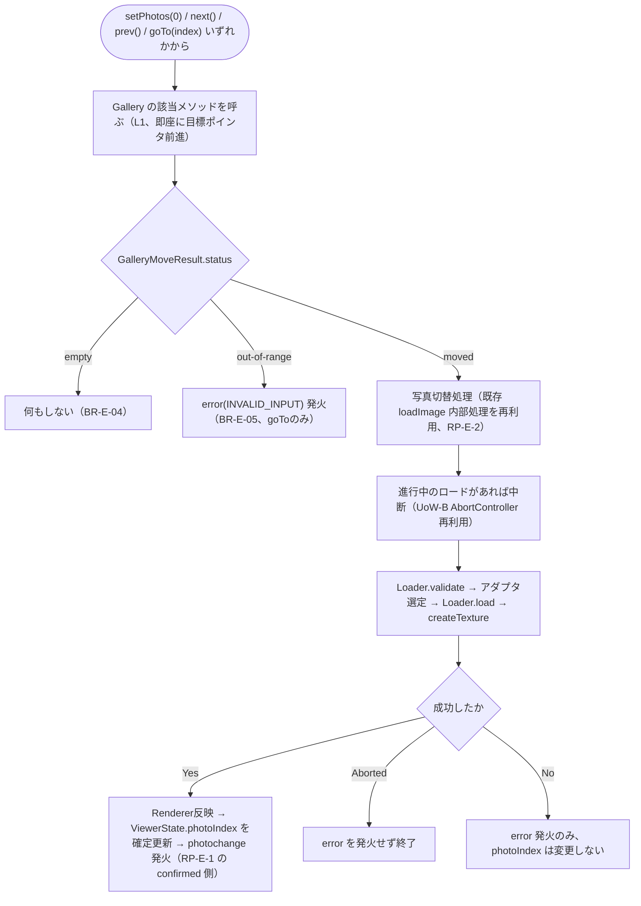
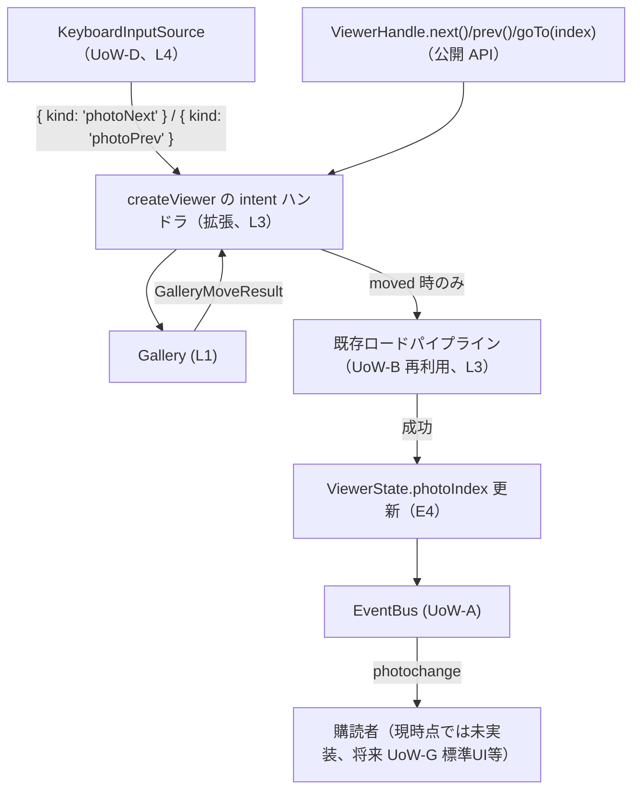

# Logical Components — UoW-E ギャラリー

- **関連 Issue**: [#40](https://github.com/AtsutoNakayama/perisphere/issues/40)
- **作成日**: 2026-08-03
- **前提資料**: `uow-e-nfr-design-plan.md`、`construction/uow-e/functional-design/domain-entities.md`（BR-E-13 反映済み）、`nfr-design-patterns.md`

`domain-entities.md` のエンティティに、本ステージで確定したパターン（`nfr-design-patterns.md`）を適用した論理コンポーネントとしての役割を対応付ける。UoW-A〜D の `logical-components.md`（各ユニット独立採番）とは独立に、本ドキュメント内で L1 から採番する。

## 1. 論理コンポーネント一覧

| # | 論理コンポーネント | 対応エンティティ | 適用パターン |
|---|---|---|---|
| L1 | `Gallery` | E1 | Pending-vs-Confirmed Pointer Separation（RP-E-1）の目標ポインタ（`current`）を保持。index 計算はクラスメソッドとして内包（NFR Design Q3、独立モジュールへの切り出しなし） |
| L2 | `normalizePhotoInput` | （新規、`business-rules.md` BR-E-01） | `Gallery.ts` 内のヘルパー関数として実装（独立モジュール化しない） |
| L3 | 写真切替オーケストレーション（`createViewer` 内、拡張） | UoW-B `loadImage` 内部処理の再利用 | 既存ロードパイプラインの再利用（RP-E-2）、`ViewerState.photoIndex` の確定更新（RP-E-1 の confirmed 側） |
| L4 | `InputManager`/`KeyboardInputSource`（拡張、統合のみ） | UoW-D E2/E6 | 新規パターンなし（`photoNext`/`photoPrev` intent の受け手を no-op から L3 経由の `next()`/`prev()` 呼び出しへ変更するのみ） |

## 2. L1 `Gallery`（Pending-vs-Confirmed Pointer Separation の目標ポインタ）

```text
class Gallery {
  private photos: readonly PhotoInput[] = [];
  private currentIndex: number = -1;         // RP-E-1: 目標（pending）ポインタ

  setPhotos(photos: readonly PhotoInput[]): void {
    this.photos = photos;
    this.currentIndex = photos.length > 0 ? 0 : -1;
  }

  next(): GalleryMoveResult { return this.move(this.currentIndex + 1); }
  prev(): GalleryMoveResult { return this.move(this.currentIndex - 1); }

  private move(rawIndex: number): GalleryMoveResult {
    if (this.photos.length === 0) return { status: "empty" };
    const size = this.photos.length;
    const index = ((rawIndex % size) + size) % size;   // モジュロ演算による巡回（BR-E-03）
    this.currentIndex = index;                          // 即座に前進（RP-E-1）
    return { status: "moved", index };
  }

  goTo(index: number): GalleryMoveResult {
    if (this.photos.length === 0) return { status: "empty" };
    if (!Number.isInteger(index) || index < 0 || index >= this.photos.length) {
      return { status: "out-of-range" };   // currentIndex は変更しない（BR-E-05）
    }
    this.currentIndex = index;             // 即座に前進（RP-E-1）
    return { status: "moved", index };
  }

  get current(): number { return this.currentIndex; }
  get size(): number { return this.photos.length; }
  getPhoto(index: number): PhotoInput | undefined { return this.photos[index]; }
}
```

- **設計意図**: `currentIndex`（＝目標ポインタ）は `next`/`prev`/`goTo` が成功判定した瞬間に更新され、対応する画像ロードの完了を待たない。ロード成功後に確定するのは呼び出し元（L3）が保持する `ViewerState.photoIndex` の方であり、`Gallery` 自身は「表示中」の概念を持たない。
- **`goTo` のみ `currentIndex` を変更しない分岐がある**: `{ status: "out-of-range" }` の場合、目標ポインタは前進させない（明示的に誤ったインデックスを指定した呼び出しは「試み」として消費しない）。これは `next`/`prev`（巡回により常に `moved` を返す）との非対称だが、`goTo` は利用者の明示的な意図（特定の写真へ飛びたい）であるため、誤った指定でポインタが動いてしまうと利用者の意図と乖離するため。

## 3. L2 `normalizePhotoInput`（`Gallery.ts` 内のヘルパー）

```ts
// packages/core/src/gallery/Gallery.ts 内（独立モジュール化しない、NFR Design Q3）
function normalizePhotoInput(photo: PhotoInput): { src: ImageInput; id?: string } {
  if (typeof photo === "string" || photo instanceof Blob) {
    return { src: photo };
  }
  return photo;
}
```

## 4. L3 写真切替オーケストレーション（`createViewer` 内、拡張）



- **UoW-B `loadImage()` との共有**: `Pipeline` の各ステップ（`Loader.validate`/アダプタ選定/`Loader.load`/`createTexture`）は `loadImage()` が既に実装済みの内部処理をそのまま呼ぶ（`business-rules.md` BR-E-06）。Code Generation では、この共有部分を `loadImage()` と写真切替の両方から呼べる内部関数として抽出する（関数分割の具体は Code Generation で確定）。

## 5. L4 `InputManager`/`KeyboardInputSource`（拡張、統合のみ）

- **変更内容**: `createViewer` の intent ハンドラ（UoW-D で `photoNext`/`photoPrev` を no-op としていた箇所、`BR-D-16`）を、それぞれ L3 の `next()`/`prev()` 呼び出しへ差し替える（`business-rules.md` BR-E-11）。
- **`InputManager`/`InputSource`/`Keymap`（UoW-D 確定済み）自体への変更はない**。既定キーマップ（`PageUp`/`PageDown`）も変更しない。

## 6. コンポーネント間の協調（統合シーケンス）



### テキスト代替

```text
KeyboardInputSource（UoW-D）が photoNext/photoPrev intent を emit するか、
利用者が ViewerHandle.next()/prev()/goTo(index) を直接呼ぶかのいずれかから始まる
どちらも同じ intent ハンドラ（L3）を経由し、Gallery（L1）で目標ポインタを即座に前進させる
GalleryMoveResult が moved の場合のみ、UoW-B の既存ロードパイプラインを再利用して写真を切り替える
ロードが成功した場合のみ ViewerState.photoIndex を確定更新し、photochange を発火する
```
