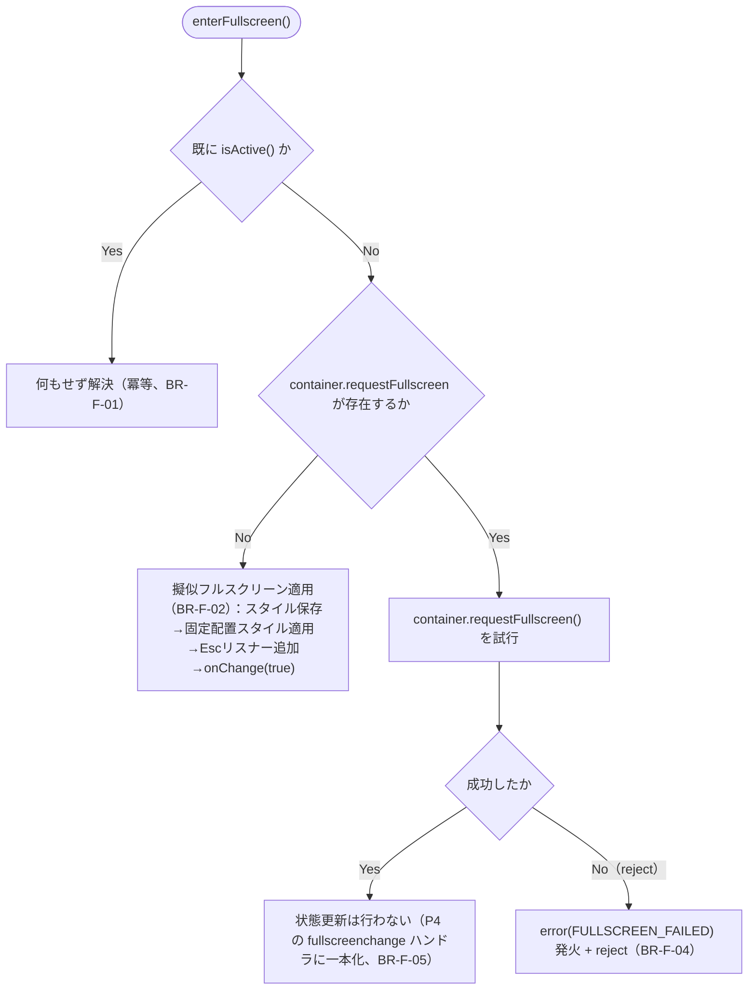
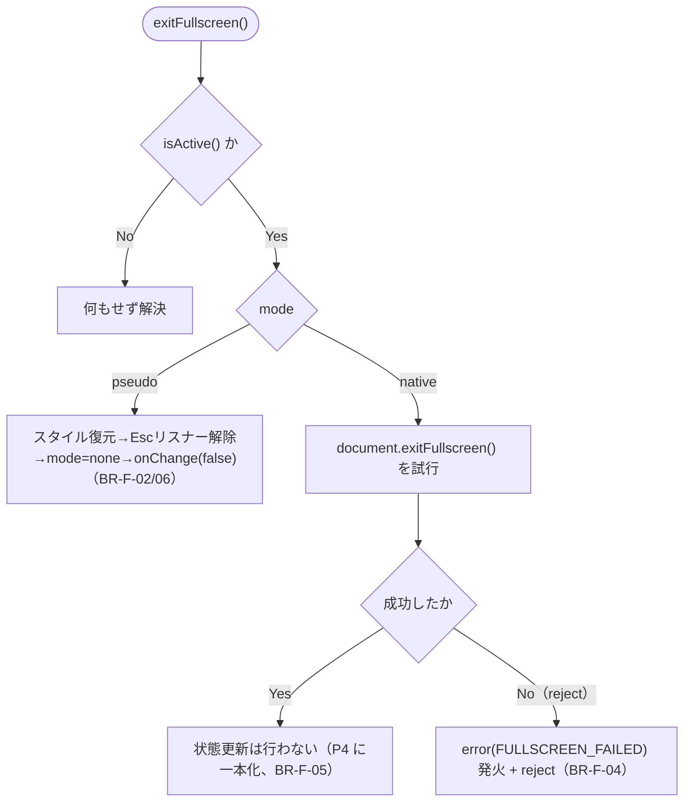
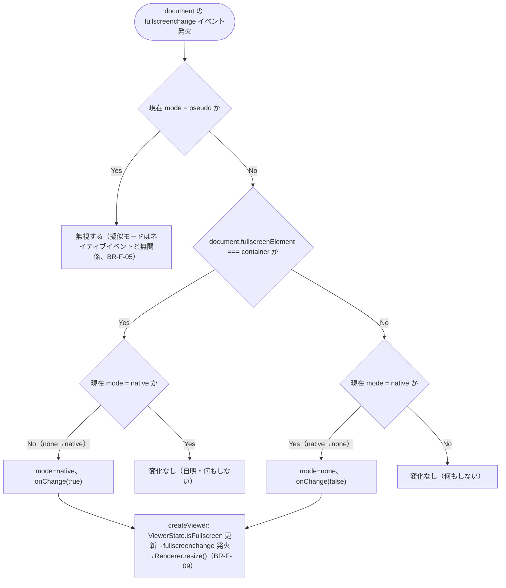

# Business Logic Model — UoW-F フルスクリーン

- **関連 Issue**: [#42](https://github.com/AtsutoNakayama/perisphere/issues/42)
- **作成日**: 2026-08-03
- **前提資料**: `domain-entities.md`、`business-rules.md`

## スコープと前提

UoW-F は「ビューワーをフルスクリーン表示に切り替え・解除できる（対応環境はネイティブ Fullscreen API、非対応環境は擬似フルスクリーン）」という到達点（M6）を担う。UoW-A（`EventBus`/`ViewerState`/`DisposableRegistry`）を状態保持・通知・破棄の基盤として利用する。UoW-D で先行実装された `toggleFullscreen` インテント・キーマップ（既定 `f`）は本ユニットで初めて実際の切替処理に結線される。同梱 UI（フルスクリーンボタン）自体の実装は UoW-G の責務範囲。

**ネイティブモードの状態遷移は `document` の `fullscreenchange` イベントに一本化する（`business-rules.md` BR-F-05）**: 以下の P1/P2 の「ネイティブ API を呼ぶ」ステップ自体は `mode`/`onChange` を更新しない。P4（`fullscreenchange` ハンドラ）だけが実際の状態更新・通知を行う。

## プロセス一覧

| # | プロセス | 対応ストーリー | 主なルール |
|---|---|---|---|
| P1 | `enterFullscreen()` | US-21, US-22 | BR-F-01〜04 |
| P2 | `exitFullscreen()` | US-21 | BR-F-01, BR-F-04〜06 |
| P3 | 擬似フルスクリーン中の Esc キー解除 | US-21, US-22 | BR-F-06 |
| P4 | `document` の `fullscreenchange` イベント処理（ネイティブモードの状態一元化） | US-21 | BR-F-05, BR-F-09 |
| P5 | `InputIntent`（`toggleFullscreen`）との統合 | US-21 | BR-F-07 |
| P6 | `dispose()` 時の自動解除 | NFR-10 | BR-F-08 |

## P1: `enterFullscreen()`



### テキスト代替

```text
1. enterFullscreen() 呼び出し時、既に isActive()（ネイティブ・擬似いずれか）なら何もせず解決する（BR-F-01）
2. container.requestFullscreen が関数として存在しない場合、擬似フルスクリーンを適用する（BR-F-02）：
   現在のインラインスタイルを保存し、position:fixed 等の固定配置スタイルを適用し、
   Escape キーリスナーを追加し、onChange(true) を呼ぶ
3. container.requestFullscreen が存在する場合、ネイティブ API（requestFullscreen()）を試行する
4. 成功した場合、この時点では mode/onChange を更新しない（P4 の fullscreenchange ハンドラが担当、BR-F-05）
5. 失敗（reject）した場合、error(FULLSCREEN_FAILED) を発火しつつ Promise を reject する（BR-F-04）。
   擬似フルスクリーンへは自動フォールバックしない
```

## P2: `exitFullscreen()`



### テキスト代替

```text
1. exitFullscreen() 呼び出し時、isActive() が false なら何もせず解決する
2. mode が "pseudo" の場合、保存しておいたインラインスタイルを復元し、Escape キーリスナーを
   解除し、mode を "none" にして onChange(false) を呼ぶ（同期的に完結、BR-F-02/BR-F-06）
3. mode が "native" の場合、document.exitFullscreen() を試行する
4. 成功した場合、この時点では mode/onChange を更新しない（P4 が担当、BR-F-05）
5. 失敗（reject）した場合、error(FULLSCREEN_FAILED) を発火しつつ Promise を reject する（BR-F-04）
```

## P3: 擬似フルスクリーン中の Esc キー解除

```text
1. 擬似フルスクリーン適用中（P1 の Pseudo 分岐後）、container に keydown リスナーが有効
2. Escape キーの押下を検知すると、exitFullscreen() の擬似モード分岐（P2 の Restore）と
   同じ処理を実行する（BR-F-06）
```

## P4: `document` の `fullscreenchange` イベント処理



### テキスト代替

```text
1. document の fullscreenchange イベントが発火するたびに内部ハンドラが呼ばれる
2. 現在 mode が "pseudo" なら何もしない（擬似モードはこのイベントと無関係、BR-F-05）
3. document.fullscreenElement === container かどうかで新しい active 状態を判定する
4. mode の実際の値と新しい active 状態が食い違う場合のみ、mode を更新し onChange(active) を呼ぶ
   （例: none→native は Fullscreen API 成功時・外部から開始された場合の両方をカバーし、
   native→none は exitFullscreen() 成功時・Esc キー等の外部終了の両方をカバーする）
5. onChange を受け取った createViewer は、ViewerState.isFullscreen を更新し、
   fullscreenchange イベント（{ type: "fullscreenchange", active }）を発火し、
   Renderer.resize() を呼ぶ（BR-F-09）
```

## P5: `InputIntent`（`toggleFullscreen`）との統合

```text
1. KeyboardInputSource（UoW-D 実装済み）が既定キーマップ（"f"）に基づき
   { kind: "toggleFullscreen" } を emit する
2. createViewer の intent ハンドラは、UoW-D 時点の no-op（BR-D-16）を解消し、
   isFullscreen() が false なら enterFullscreen()、true なら exitFullscreen() を呼ぶ（BR-F-07）
3. 返る Promise の reject は .catch(() => {}) で握りつぶす（error イベントは BR-F-04 で
   既に発火済みのため、ここでは未処理の Promise rejection を防ぐだけ）
```

## P6: `dispose()` 時の自動解除

```text
1. createViewer 初期化時、FullscreenManager.dispose を DisposableRegistry に登録する
2. ViewerHandle.dispose() → DisposableRegistry.disposeAll() 経由で FullscreenManager.dispose() が呼ばれる
3. mode が "native" なら document.exitFullscreen() を呼ぶ（完了を待たない、BR-F-08）
4. mode が "pseudo" ならスタイルを同期的に復元する（BR-F-08）
5. document の fullscreenchange リスナー・（擬似モード中の）Escape キーリスナーを解除する
```
