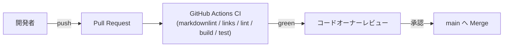

# Deployment Architecture — UoW-F フルスクリーン

- **関連 Issue**: [#42](https://github.com/AtsutoNakayama/perisphere/issues/42)
- **作成日**: 2026-08-03

## 現時点の配布フロー（UoW-A〜E から変更なし）

UoW-A〜E の `deployment-architecture.md` と同一のフロー。UoW-F によるインフラ変更はない。npm 公開フローは引き続き未構築。

## UoW-F 完了時点でのインフラ変更サマリ

なし。`packages/core/src/fullscreen/` 配下のアプリケーションコード追加と `viewer/` への拡張のみで、既存 CI ジョブ（`lint`/`build`/`test`）がそのままカバーする。
