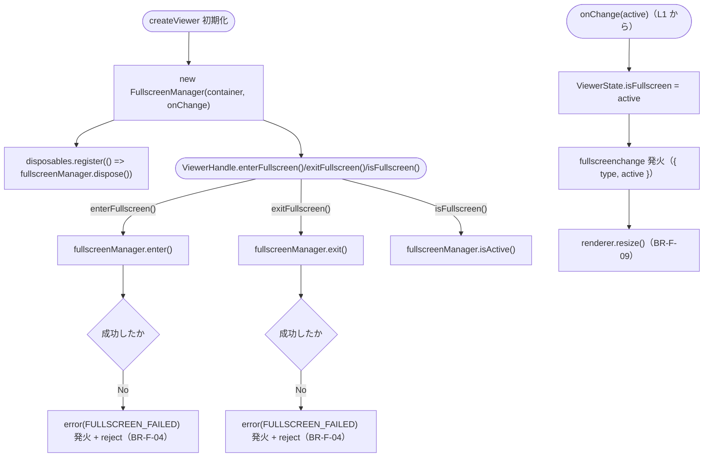
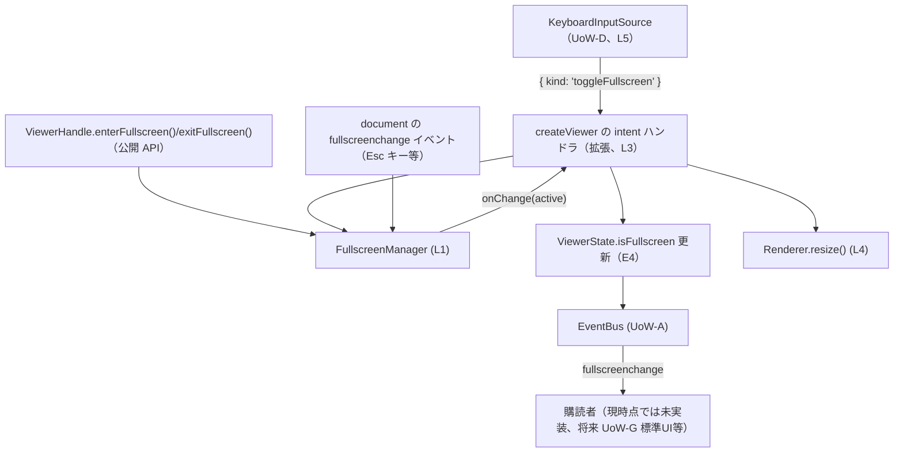

# Logical Components — UoW-F フルスクリーン

- **関連 Issue**: [#42](https://github.com/AtsutoNakayama/perisphere/issues/42)
- **作成日**: 2026-08-03
- **前提資料**: `uow-f-nfr-design-plan.md`、`construction/uow-f/functional-design/domain-entities.md`（BR-F-08 反映済み）、`nfr-design-patterns.md`

`domain-entities.md` のエンティティに、本ステージで確定したパターン（`nfr-design-patterns.md`）を適用した論理コンポーネントとしての役割を対応付ける。UoW-A〜E の `logical-components.md`（各ユニット独立採番）とは独立に、本ドキュメント内で L1 から採番する。

## 1. 論理コンポーネント一覧

| # | 論理コンポーネント | 対応エンティティ | 適用パターン |
|---|---|---|---|
| L1 | `FullscreenManager` | E1, E2 | RP-F-1（Silent Best-Effort Cleanup）・RP-F-2（Native-Change-Event as Single Source of Truth）。配置は `packages/core/src/fullscreen/FullscreenManager.ts`（LC-F-1） |
| L2 | `document` の `fullscreenchange` リスナー / `Escape` キーリスナー（`FullscreenManager` 内部） | （新規、`business-rules.md` BR-F-05/06） | RP-F-2。独立モジュール化しない（LC-F-2） |
| L3 | フルスクリーン切替オーケストレーション（`createViewer` 内、拡張） | E4〜E6 | `onChange` コールバックで `ViewerState.isFullscreen` 更新・`fullscreenchange` 発火・`Renderer.resize()` 呼び出し（BR-F-09） |
| L4 | `Renderer`（拡張） | E7 | `resize()` を追加。計算ロジックは独立モジュール化しない（LC-F-2） |
| L5 | `InputManager`/`KeyboardInputSource`（拡張、統合のみ） | UoW-D 既存 | 新規パターンなし（`toggleFullscreen` intent の受け手を no-op から L3 経由の `enterFullscreen()`/`exitFullscreen()` 呼び出しへ変更するのみ） |

## 2. L1 `FullscreenManager`

```text
// packages/core/src/fullscreen/FullscreenManager.ts（LC-F-1）
class FullscreenManager {
  private mode: FullscreenMode = "none";       // E2
  private savedStyleCssText: string | null = null;

  constructor(
    private readonly container: HTMLElement,
    private readonly onChange: (active: boolean) => void,
  ) {
    document.addEventListener("fullscreenchange", this.handleNativeChange);  // RP-F-2
  }

  isActive(): boolean {
    return this.mode !== "none";
  }

  async enter(): Promise<void> {
    if (this.mode !== "none") return;                       // BR-F-01: 冪等
    if (typeof this.container.requestFullscreen === "function") {
      await this.container.requestFullscreen();              // 失敗時はそのまま reject（BR-F-04）
      return;                                                 // mode/onChange は handleNativeChange に一本化（RP-F-2）
    }
    this.enterPseudo();                                       // BR-F-02
  }

  async exit(): Promise<void> {
    if (this.mode === "none") return;
    if (this.mode === "pseudo") {
      this.exitPseudo();
      return;
    }
    await document.exitFullscreen();                          // 失敗時はそのまま reject（BR-F-04）
  }

  dispose(): void {
    if (this.mode === "native") {
      void document.exitFullscreen?.().catch(() => {});        // RP-F-1: Silent Best-Effort Cleanup
    } else if (this.mode === "pseudo") {
      this.exitPseudo();
    }
    document.removeEventListener("fullscreenchange", this.handleNativeChange);
  }

  private enterPseudo(): void { /* スタイル保存→適用→Escリスナー追加→mode="pseudo"→onChange(true)（BR-F-02, BR-F-06） */ }
  private exitPseudo(): void { /* スタイル復元→Escリスナー解除→mode="none"→onChange(false) */ }

  private handleNativeChange = (): void => {                   // L2, RP-F-2
    if (this.mode === "pseudo") return;
    const active = document.fullscreenElement === this.container;
    const nextMode: FullscreenMode = active ? "native" : "none";
    if (nextMode === this.mode) return;
    this.mode = nextMode;
    this.onChange(active);
  };

  private handleEscapeKey = (event: KeyboardEvent): void => {   // L2, BR-F-06
    if (event.key === "Escape") this.exitPseudo();
  };
}
```

- **設計意図**: `mode`（E2）の更新は `handleNativeChange`（ネイティブモード）と `enterPseudo`/`exitPseudo`（擬似モード）のみが行い、`enter()`/`exit()` 自体はブラウザ API 呼び出しの成否判定に専念する。これにより自己起点・外部起点の状態変化を1本のコードパスに統一する（RP-F-2）。

## 3. L2 `document` の `fullscreenchange` リスナー / `Escape` キーリスナー

`FullscreenManager`（L1）のプライベートメソッドとして実装し、独立モジュール化しない（LC-F-2、YAGNI）。`fullscreenchange` リスナーはコンストラクタで登録し `dispose()` で解除する（インスタンスのライフサイクル全体）。`Escape` キーリスナーは擬似モード中のみ `container` に対して追加・削除する。

## 4. L3 フルスクリーン切替オーケストレーション（`createViewer` 内、拡張）



### テキスト代替

```text
1. createViewer 初期化時、FullscreenManager を構築し onChange コールバックを渡す
2. FullscreenManager.dispose を DisposableRegistry に登録する
3. ViewerHandle.enterFullscreen()/exitFullscreen() は fullscreenManager.enter()/exit() を呼び、
   失敗（reject）した場合は error(FULLSCREEN_FAILED) を発火しつつ reject する（BR-F-04）
4. ViewerHandle.isFullscreen() は fullscreenManager.isActive() をそのまま返す
5. onChange(active) が呼ばれるたび（自己起点・外部起点いずれも）、
   ViewerState.isFullscreen を更新し、fullscreenchange イベントを発火し、
   renderer.resize() を呼ぶ（BR-F-09）
```

## 5. L4 `Renderer`（拡張）

`resize()` は `container.clientWidth`/`clientHeight` を読み直し、`camera.aspect` の更新（`updateProjectionMatrix()`）と `webglRenderer.setSize()` を行う。初期化時の `buildSceneGraph` と計算式を共有するが、呼び出し元が `Renderer` 自身のみのため独立関数へは切り出さない（LC-F-2）。

## 6. L5 `InputManager`/`KeyboardInputSource`（拡張、統合のみ）

- **変更内容**: `createViewer` の intent ハンドラ（UoW-D で `toggleFullscreen` を no-op としていた箇所、`BR-D-16`）を、`isFullscreen()` の値に応じて L3 の `enterFullscreen()`/`exitFullscreen()` を呼ぶよう差し替える（`business-rules.md` BR-F-07）。
- **`InputManager`/`InputSource`/`Keymap`（UoW-D 確定済み）自体への変更はない**。既定キーマップ（`"f"`）も変更しない。

## 7. コンポーネント間の協調（統合シーケンス）



### テキスト代替

```text
KeyboardInputSource（UoW-D）が toggleFullscreen intent を emit するか、
利用者が ViewerHandle.enterFullscreen()/exitFullscreen() を直接呼ぶか、
あるいは Esc キー等でブラウザ側から直接ネイティブフルスクリーンが終了するかのいずれかから始まる
すべての経路が FullscreenManager（L1）に集約され、onChange(active) を通じて
createViewer の intent ハンドラ（L3）へ通知される
L3 は ViewerState.isFullscreen を更新し、fullscreenchange を発火し、Renderer.resize()（L4）を呼ぶ
```
