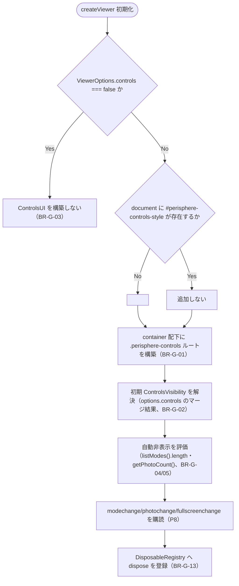
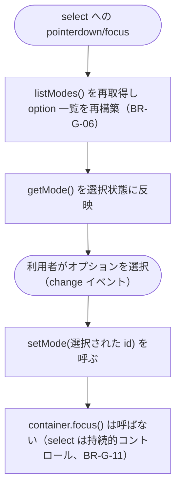

# Business Logic Model — UoW-G 同梱コントロール UI

- **関連 Issue**: [#44](https://github.com/AtsutoNakayama/perisphere/issues/44)
- **作成日**: 2026-08-04
- **前提資料**: `domain-entities.md`、`business-rules.md`

## スコープと前提

UoW-G は「素 DOM の同梱コントロール UI（フルスクリーン／ズーム／モード切替／写真切替＋インジケーター）で M3〜M6（UoW-C〜F）の操作ができる」という到達点（M7）を担う。UoW-A（`EventBus`/`ViewerState`/`DisposableRegistry`）を基盤とし、UoW-C（`listModes`/`setMode`）・UoW-D（`setView`/キーボードのフォーカス限定挙動）・UoW-E（`Gallery`/`next`/`prev`/`goTo`）・UoW-F（`enterFullscreen`/`exitFullscreen`/`isFullscreen`）が公開する `ViewerHandle` メンバーを呼び出すだけの疎結合な構成。`ControlsUI` はコアの内部状態に直接アクセスせず、常に `ViewerHandle` の部分集合（`ControlsUIDeps`）とイベント購読を介して動作する。

## プロセス一覧

| # | プロセス | 対応ストーリー | 主なルール |
|---|---|---|---|
| P1 | `ControlsUI` の構築（`createViewer` 初期化時） | US-26 | BR-G-01, BR-G-02, BR-G-03, BR-G-12 |
| P2 | 表示状態の計算（明示指定 × 自動非表示） | US-24, US-26 | BR-G-04, BR-G-05 |
| P3 | フルスクリーンボタン操作 | US-21, US-26 | BR-G-11 |
| P4 | ズームボタン操作 | US-13, US-20 | BR-G-14, BR-G-11 |
| P5 | モード切替操作（`<select>` の遅延構築込み） | US-12, US-26 | BR-G-06 |
| P6 | 写真前後操作 | US-18, US-23 | BR-G-09, BR-G-11 |
| P7 | 写真インジケーター操作 | US-24 | BR-G-08, BR-G-11 |
| P8 | イベント購読による UI 同期 | US-21, US-24, US-26 | BR-G-04, BR-G-05, BR-G-07 |
| P9 | `setControlsVisibility()`/`setText()` 呼び出し | US-26, US-27 | BR-G-02, BR-G-10, BR-G-15 |
| P10 | `dispose()` | NFR-10 | BR-G-13 |

## P1: `ControlsUI` の構築



### テキスト代替

```text
1. createViewer 初期化時、ViewerOptions.controls が false なら ControlsUI を構築せず終了する（BR-G-03）
2. false でない場合、同一 document に #perisphere-controls-style がなければ <style> を1つだけ追加する（BR-G-12）
3. container 配下に .perisphere-controls ルート要素と各コントロールの DOM を構築する（BR-G-01）
4. ViewerOptions.controls（boolean | Partial<ControlsVisibility>）から初期 ControlsVisibility を解決する（BR-G-02）
5. listModes().length・getPhotoCount() に基づき modeSwitch/photoNav/photoIndicator の自動非表示を評価する（BR-G-04/05）
6. modechange/photochange/fullscreenchange イベントを購読する（P8）
7. DisposableRegistry へ dispose() を登録する（BR-G-13）
```

## P2: 表示状態の計算

```text
1. 各コントロールグループ（fullscreen/zoom/modeSwitch/photoNav/photoIndicator）について、
   明示指定（ControlsVisibility の該当キー）が false なら常に非表示
2. 明示指定が true（既定含む）の場合:
   - fullscreen/zoom は常に表示（該当データの有無という概念がないため）
   - modeSwitch は listModes().length > 1 のときのみ表示（BR-G-04）
   - photoNav/photoIndicator は getPhotoCount() > 1 のときのみ表示（BR-G-05）
3. 実際の表示可否 = 明示指定 AND (該当データありの場合の自動条件)
```

## P3: フルスクリーンボタン操作

```text
1. クリック時、isFullscreen() が false なら enterFullscreen()、true なら exitFullscreen() を呼ぶ
2. 返る Promise の reject は .catch(() => {}) で握りつぶす（error イベントはコア側で既に発火済み、
   UoW-F BR-F-07 と同じ「未処理 rejection を防ぐだけ」のガード）
3. container.focus() を呼びフォーカスを戻す（BR-G-11）
4. ボタンのラベル/aria-label は fullscreenchange イベント（P8）で同期するため、ここでは更新しない
```

## P4: ズームボタン操作

```text
1. クリック時、getView().fov を取得する
2. ズームイン: newFov = fov * CONTROLS_ZOOM_RATIO／ズームアウト: newFov = fov / CONTROLS_ZOOM_RATIO
   （BR-G-14、乗算モデル）
3. setView({ fov: newFov }) を呼ぶ（クランプは setView 内部で自動的に適用される）
4. container.focus() を呼びフォーカスを戻す（BR-G-11）
```

## P5: モード切替操作



### テキスト代替

```text
1. select への pointerdown/focus のたびに listModes() を再取得し option 一覧を再構築する（BR-G-06）
2. 構築のたびに現在値（getMode()）を選択状態へ反映する
3. change イベント（利用者がオプションを選択）で setMode(選択された id) を呼ぶ
4. モード切替 select は持続的なフォームコントロールのため、フォーカスは select 自身に残す
   （BR-G-11 の対象外）
```

## P6: 写真前後操作

```text
1. 前後ボタンのクリック時、それぞれ prev()/next() を呼ぶ（境界での巡回は UoW-E BR-E-03 に従う）
2. 表示状態（現在位置の反映）は photochange イベント（P8）で同期する
3. container.focus() を呼びフォーカスを戻す（BR-G-11）
```

## P7: 写真インジケーター操作

```text
1. 各インジケーターボタンのクリック時、対応する index で goTo(index) を呼ぶ（BR-G-08）
2. container.focus() を呼びフォーカスを戻す（BR-G-11）
3. 表示状態（aria-current の付け替え）は photochange イベント（P8）で同期する
```

## P8: イベント購読による UI 同期

```text
1. modechange 受信時:
   - select の選択状態を新しい mode に同期する
   - modeSwitch の自動非表示を再評価する（listModes().length、BR-G-04）
2. photochange 受信時:
   - 前後ボタン・インジケーターの現在位置（aria-current）を event.index に同期する
   - photoNav/photoIndicator の自動非表示を event.total（BR-G-07）に基づき再評価する（BR-G-05）
   - event.total が構築時と異なればインジケーターのボタン列を再構築する
3. fullscreenchange 受信時:
   - フルスクリーンボタンのラベル/aria-label を event.active に応じて
     fullscreenEnterLabel/fullscreenExitLabel（UITextMap）に切り替える
```

## P9: `setControlsVisibility()`/`setText()` 呼び出し

```text
1. setControlsVisibility(config) 呼び出し時、ControlsUI が構築済みなら現在の ControlsVisibility へ
   config をマージし、P2 の表示状態計算を再実行して DOM の表示/非表示を更新する（BR-G-02）
2. ControlsUI が未構築（ヘッドレス）なら何もしない（BR-G-15）
3. setText(overrides) 呼び出し時、ControlsUI が構築済みなら現在の UITextMap へ overrides をマージし、
   各要素の文言・aria-label・プレースホルダトークン（BR-G-10）を再描画する
4. ControlsUI が未構築（ヘッドレス）なら何もしない（BR-G-15）
```

## P10: `dispose()`

```text
1. createViewer 初期化時、ControlsUI.dispose を DisposableRegistry に登録する（ControlsUI が
   構築された場合のみ）
2. ViewerHandle.dispose() → DisposableRegistry.disposeAll() 経由で ControlsUI.dispose() が呼ばれる
3. .perisphere-controls ルート要素以下を container から除去する
4. modechange/photochange/fullscreenchange の購読を解除する（BR-G-13）
5. 共有 <style id="perisphere-controls-style"> は除去しない（他インスタンスが使用中の可能性、BR-G-12）
```
