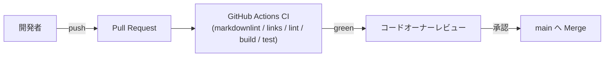

# Deployment Architecture — UoW-G 同梱コントロール UI

- **関連 Issue**: [#44](https://github.com/AtsutoNakayama/perisphere/issues/44)
- **作成日**: 2026-08-04

## 現時点の配布フロー（UoW-A〜F から変更なし）

UoW-A〜F の `deployment-architecture.md` と同一のフロー。UoW-G によるインフラ変更はない。npm 公開フローは引き続き未構築。

## UoW-G 完了時点でのインフラ変更サマリ

なし。`packages/core/src/ui/` 配下のアプリケーションコード追加と `viewer/`/`gallery/` への拡張のみで、既存 CI ジョブ（`lint`/`build`/`test`）がそのままカバーする。
