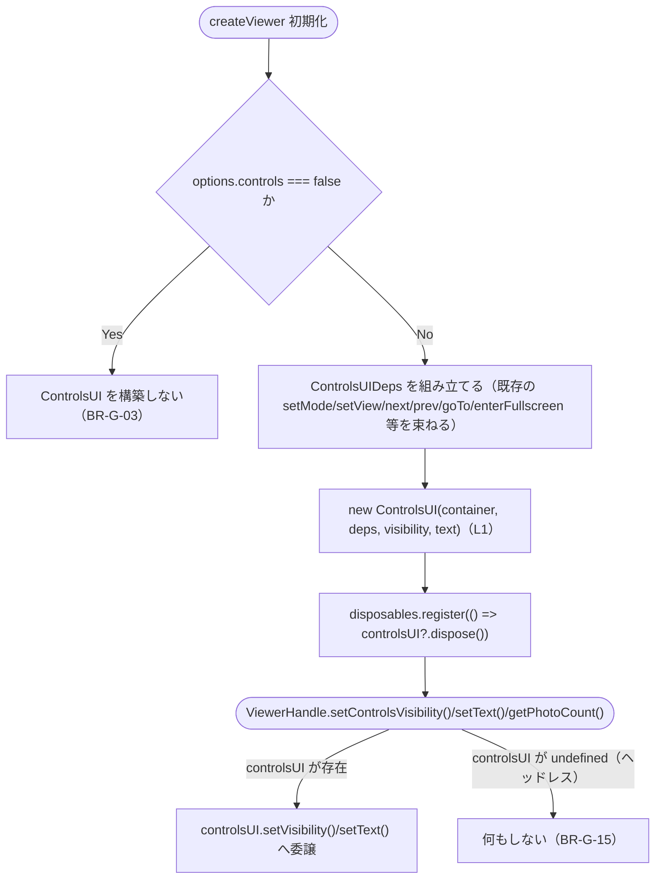
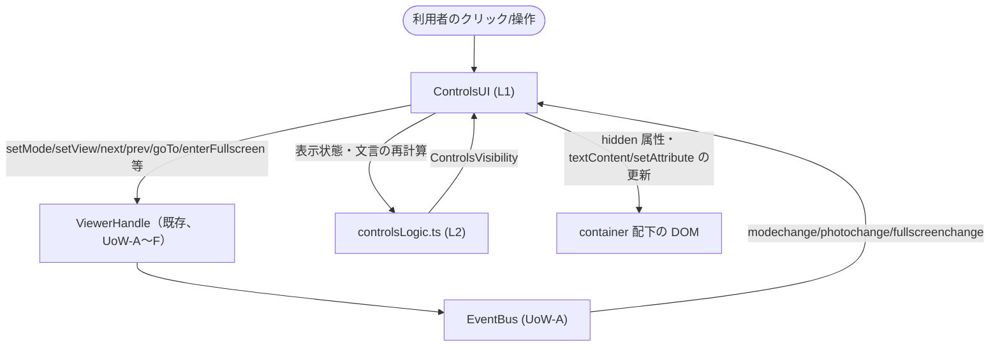

# Logical Components — UoW-G 同梱コントロール UI

- **関連 Issue**: [#44](https://github.com/AtsutoNakayama/perisphere/issues/44)
- **作成日**: 2026-08-04
- **前提資料**: `uow-g-nfr-design-plan.md`、`construction/uow-g/functional-design/domain-entities.md`、`nfr-design-patterns.md`

`domain-entities.md` のエンティティに、本ステージで確定したパターン（`nfr-design-patterns.md`）を適用した論理コンポーネントとしての役割を対応付ける。UoW-A〜F の `logical-components.md`（各ユニット独立採番）とは独立に、本ドキュメント内で L1 から採番する。

## 1. 論理コンポーネント一覧

| # | 論理コンポーネント | 対応エンティティ | 適用パターン |
|---|---|---|---|
| L1 | `ControlsUI` | E1 | RP-G-1（Silent Best-Effort Action）・SP-G-1（Safe Text Rendering）。配置は `packages/core/src/ui/ControlsUI.ts`（LC-G-1） |
| L2 | `controlsLogic.ts`（`computeEffectiveVisibility`/`resolveText`） | （新規、`business-rules.md` BR-G-04/05/10） | LC-G-2（テスト容易性を動機とした純粋関数の分離） |
| L3 | `ui/types.ts`（`ControlsVisibility`/`UITextMap`/`DEFAULT_UI_TEXT`） | E2, E3 | LC-G-1 |
| L4 | 同梱 UI オーケストレーション（`createViewer` 内、拡張） | E4〜E6 | `ControlsUIDeps` の組み立て・`setControlsVisibility`/`setText`/`getPhotoCount` の委譲・ヘッドレス時の no-op（BR-G-15） |
| L5 | `Gallery`/`switchToPhoto`（拡張、写真総数の供給） | E6 | `photochange` ペイロードへの `total` 追加（BR-G-07） |

## 2. L1 `ControlsUI`

```text
// packages/core/src/ui/ControlsUI.ts（LC-G-1）
class ControlsUI {
  private visibility: ControlsVisibility;
  private text: Required<UITextMap>;
  private readonly root: HTMLDivElement;

  constructor(
    private readonly container: HTMLElement,
    private readonly deps: ControlsUIDeps,
    initialVisibility: ControlsVisibility,
    initialText: UITextMap,
  ) {
    ensureSharedStylesheet();                                    // BR-G-12
    this.visibility = initialVisibility;
    this.text = { ...DEFAULT_UI_TEXT, ...initialText };
    this.root = buildDom(container, deps, this.text);             // BR-G-01
    this.applyVisibility();                                       // L2 経由（P2）
    deps.on("modechange", this.handleModeChange);
    deps.on("photochange", this.handlePhotoChange);
    deps.on("fullscreenchange", this.handleFullscreenChange);
  }

  setVisibility(config: Partial<ControlsVisibility>): void {
    this.visibility = { ...this.visibility, ...config };          // BR-G-02
    this.applyVisibility();
  }

  setText(overrides: Partial<UITextMap>): void {
    this.text = { ...this.text, ...overrides };
    rerenderText(this.root, this.text);                           // SP-G-1: textContent/setAttribute のみ
  }

  dispose(): void {
    deps.off("modechange", this.handleModeChange);
    deps.off("photochange", this.handlePhotoChange);
    deps.off("fullscreenchange", this.handleFullscreenChange);
    this.root.remove();                                            // 共有 <style> は除去しない（BR-G-13）
  }

  private applyVisibility(): void {
    const effective = computeEffectiveVisibility(                 // L2
      this.visibility,
      this.deps.listModes().length,
      this.deps.getPhotoCount(),
    );
    applyHiddenAttributes(this.root, effective);
  }

  private handleModeChange = (): void => { syncModeSelect(this.root, this.deps); this.applyVisibility(); };
  private handlePhotoChange = (event: PhotoChangeEvent): void => { syncPhotoUI(this.root, event); this.applyVisibility(); };
  private handleFullscreenChange = (event: FullscreenChangeEvent): void => { syncFullscreenButton(this.root, event, this.text); };
}
```

- **設計意図**: DOM 構築・イベント購読・破棄の3つのライフサイクルフェーズを持つ。表示状態の判定自体は L2 の純粋関数へ完全に委譲し、`ControlsUI` は「判定結果を DOM の `hidden` 属性へ反映する」という副作用のみを担う（`business-logic-model.md` P1/P2/P8）。

## 3. L2 `controlsLogic.ts`（純粋関数）

```ts
// packages/core/src/ui/controlsLogic.ts（LC-G-2）
export function computeEffectiveVisibility(
  explicit: ControlsVisibility,
  modeCount: number,
  photoCount: number,
): ControlsVisibility {
  return {
    fullscreen: explicit.fullscreen ?? true,
    zoom: explicit.zoom ?? true,
    modeSwitch: (explicit.modeSwitch ?? true) && modeCount > 1,      // BR-G-04
    photoNav: (explicit.photoNav ?? true) && photoCount > 1,          // BR-G-05
    photoIndicator: (explicit.photoIndicator ?? true) && photoCount > 1,
  };
}

export function resolveText(template: string, values: Record<string, string | number>): string {
  return Object.entries(values).reduce(
    (acc, [key, value]) => acc.replaceAll(`{${key}}`, String(value)),
    template,
  );                                                                   // BR-G-10
}
```

- **設計意図**: DOM・`EventBus`・three.js のいずれにも依存しない純粋関数。`fast-check` による PBT（`nfr-requirements.md` Q2）はこの2関数を対象に、`ControlsUI` を経由せず直接呼び出して不変条件を検証する。

## 4. L3 `ui/types.ts`

`ControlsVisibility`/`UITextMap`（`domain-entities.md` E2/E3）と既定文言 `DEFAULT_UI_TEXT` を定義する。`ControlsUIDeps`（`domain-entities.md` E1）もここに定義し、`ControlsUI.ts`・`createViewer.ts` の双方から参照する。

## 5. L4 同梱 UI オーケストレーション（`createViewer` 内、拡張）



### テキスト代替

```text
1. createViewer 初期化時、options.controls が false なら ControlsUI を構築しない（BR-G-03）
2. false でない場合、既存の各メンバー関数（setMode/setView/next/prev/goTo/enterFullscreen 等）を
   束ねた ControlsUIDeps を組み立て、new ControlsUI(...) を構築する（L1）
3. controlsUI.dispose を DisposableRegistry に登録する
4. ViewerHandle.setControlsVisibility()/setText()/getPhotoCount() は、
   controlsUI が存在すればそれぞれ委譲し、存在しなければ安全な no-op（getPhotoCount は gallery 経由でヘッドレス時も動作）とする（BR-G-15）
```

## 6. L5 `Gallery`/`switchToPhoto`（拡張、写真総数の供給）

- **変更内容**: `createViewer` 内の `switchToPhoto`（UoW-E 実装済み）が `photochange` を発火する箇所で、`Gallery` が保持する写真総数（`gallery.count()` 等、内部メソッド）を `total` として含める（`business-rules.md` BR-G-07）。`ViewerHandle.getPhotoCount()` も同じ内部値をそのまま返す。
- **`Gallery`（UoW-E 確定済み）自体への変更**: 総数を取得する内部メソッドを1つ追加するのみで、既存の `next`/`prev`/`goTo`/`setPhotos` のロジック（`BR-E-02〜13`）は変更しない。

## 7. コンポーネント間の協調（統合シーケンス）



### テキスト代替

```text
利用者がコントロールを操作すると、ControlsUI（L1）は対応する ViewerHandle のメンバー
（setMode/setView/next/prev/goTo/enterFullscreen 等）を呼ぶだけで、コアの内部状態には直接触れない。
コア側の処理結果は EventBus を経由した modechange/photochange/fullscreenchange イベントとして
ControlsUI へ通知され、ControlsUI は controlsLogic.ts（L2）で表示状態・文言を再計算したうえで
DOM の hidden 属性・textContent/setAttribute を更新する（一方向のデータフロー、UoW-A〜F への
新規依存を作らない疎結合、unit-of-work.md の設計方針どおり）
```
