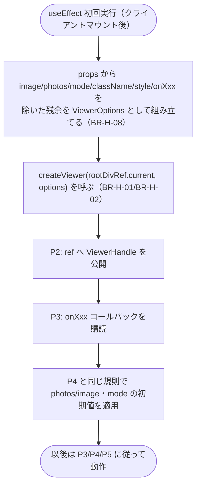
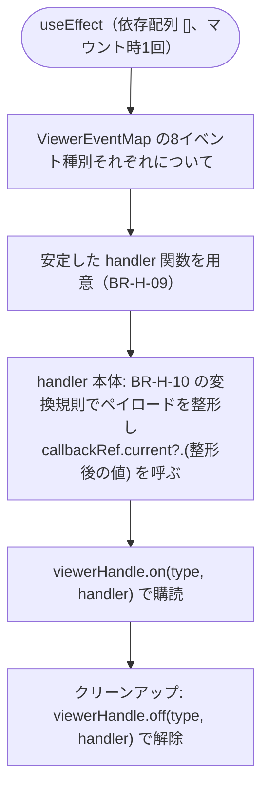

# Business Logic Model — UoW-H React アダプタ

- **関連 Issue**: [#46](https://github.com/AtsutoNakayama/perisphere/issues/46)
- **作成日**: 2026-08-04
- **前提資料**: `domain-entities.md`、`business-rules.md`

## スコープと前提

UoW-H は「React コンポーネント/フック/ref で利用できる」という到達点（M8）を担う。`@perisphere/core` の `createViewer`/`ViewerHandle`/`ViewerOptions`/`ViewerEventMap` を呼び出すだけの薄いラッパで、コア機能を再実装しない（`services.md`）。UoW-A〜G が確定済みのため、本ユニットは全機能が揃った状態で結合できる。

## プロセス一覧

| # | プロセス | 対応ストーリー | 主なルール |
|---|---|---|---|
| P1 | マウント時の初期化（`createViewer` 呼び出し） | US-28, US-34 | BR-H-01, BR-H-02, BR-H-08 |
| P2 | ref（`PerisphereHandle`）の公開 | US-28 | BR-H-04 |
| P3 | イベントコールバックの購読設定 | US-29 | BR-H-09, BR-H-10 |
| P4 | `image`/`photos`/`mode` prop 変更の反映 | US-28 | BR-H-05, BR-H-06 |
| P5 | unmount 時の破棄 | NFR-10, US-31 | BR-H-02, BR-H-03, BR-H-11 |
| P6 | `usePerisphere()` の利用 | US-28 | — |

## P1: マウント時の初期化



### テキスト代替

```text
1. useEffect の初回実行（クライアントでのマウント後のみ、BR-H-02）で開始する
2. props から image/photos/mode/className/style/onXxx（8種）を除いた残余オブジェクトを
   ViewerOptions として組み立てる（controls/text 含む、BR-H-08）
3. createViewer(rootDivRef.current, options) を呼ぶ（BR-H-01: rootDivRef は内部レンダリングした
   ルート <div> への参照）
4. P2 の手順で ref へ ViewerHandle を即座に公開する
5. P3 の手順で onXxx コールバックの購読を設定する
6. P4 と同じ適用規則（photos 優先、BR-H-05）で image/photos/mode の初期値を適用する
7. 以後、props の変更は P4、イベントは P3 で設定した購読、unmount は P5 に従う
```

## P2: ref（`PerisphereHandle`）の公開

```text
1. createViewer() の戻り値（ViewerHandle）を、useEffect 内で useImperativeHandle の実装関数から
   返せるよう、内部 state/ref（例: handleRef）に格納する
2. useImperativeHandle(forwardedRef, () => handleRef.current) は handleRef の変更を検知して
   forwardedRef.current を更新する（ready イベントを待たない、BR-H-04）
3. handleRef.current は PerisphereHandle（= ViewerHandle、domain-entities.md E2）そのもの
```

## P3: イベントコールバックの購読設定



### テキスト代替

```text
1. useEffect（依存配列 []、マウント時1回のみ実行）内で、ViewerEventMap の8イベント種別
   （ready/error/progress/modechange/viewchange/zoomchange/photochange/fullscreenchange）
   それぞれについて安定した handler 関数を用意する（BR-H-09）
2. 各 handler は呼び出されるたびに、対応する callbackRef（onXxx の最新値を保持する ref）の
   現在値を BR-H-10 の変換規則で整形したペイロードとともに呼ぶ
3. viewerHandle.on(type, handler) で購読する
4. onXxx props 自体はレンダリングのたびに対応する callbackRef へ代入するのみで、
   購読の張り直しは行わない（BR-H-09）
5. useEffect のクリーンアップで viewerHandle.off(type, handler) を呼び購読を解除する
```

## P4: `image`/`photos`/`mode` prop 変更の反映

```text
1. photos 用 useEffect（依存配列 [photos]）: photos が変化するたびに、
   photos !== undefined なら setPhotos(photos) を呼ぶ（BR-H-06）
2. image 用 useEffect（依存配列 [image, photos]）: image が変化した場合、または
   photos が undefined から値へ/値から undefined へ変化した場合に再評価し、
   photos === undefined かつ image !== undefined のときのみ loadImage(image) を呼ぶ
   （BR-H-05: photos 優先。photos が指定されている間は image 側の呼び出しをスキップする）
3. mode 用 useEffect（依存配列 [mode]）: mode が変化するたびに、mode !== undefined なら
   setMode(mode) を呼ぶ（BR-H-06）
4. いずれの useEffect も、P1 の初期化（マウント時の useEffect）が完了した後に実行される
   （P1 の初期値適用と合わせて、初回レンダリングでの二重呼び出しは発生しない。
   React の useEffect 実行順序上、マウント時は P1 内の初期適用のみが実行され、
   本プロセスの各 useEffect は「前回値との比較」を伴わない初回実行として
   同じ値を再度渡すが、コア側の setPhotos/loadImage/setMode は同一値の再適用でも
   副作用が既存の仕様の範囲に収まる〔UoW-B/E/C で確立済み〕ため実害はない）
```

## P5: unmount 時の破棄

```text
1. useEffect（P1）のクリーンアップ関数が呼ばれる（unmount 時、または BR-H-03 の
   StrictMode 二重実行の1回目のクリーンアップ時）
2. P3 で設定した8種のイベント購読を viewerHandle.off() で解除する
3. viewerHandle.dispose() を呼ぶ（BR-H-11）
4. ref（P2）は次にマウントされるまで forwardedRef.current が古いインスタンスを
   指したままになりうるが、dispose 済みの ViewerHandle への呼び出しは安全な no-op
   （UoW-A〜G で確立済みの dispose 後の冪等性）
```

## P6: `usePerisphere()` の利用

```text
1. 呼び出し側が const { ref } = usePerisphere() を呼ぶ
2. 返る ref（React.RefObject<PerisphereHandle | null>）を <Perisphere ref={ref} /> に渡す
3. マウント後（P1〜P2）、ref.current から PerisphereHandle の全メンバーを呼び出せる
4. usePerisphere() 自体は useRef のラップのみで、追加の状態やライフサイクル管理を持たない
```
