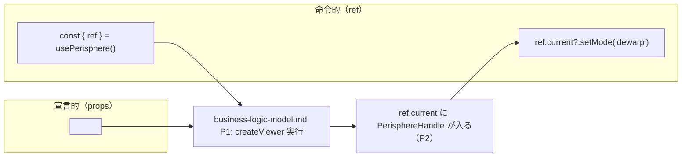

# Frontend Components — UoW-H React アダプタ

- **関連 Issue**: [#46](https://github.com/AtsutoNakayama/perisphere/issues/46)
- **作成日**: 2026-08-04
- **前提資料**: `domain-entities.md`、`business-rules.md`、`business-logic-model.md`
- **注記**: 本ユニットは React コンポーネント/フックそのものが成果物（UoW-G の `ControlsUI` とは異なり、素 DOM ではなく React を用いる）。

## コンポーネント階層

```text
<Perisphere>                                  （C16、forwardRef コンポーネント）
└── <div ref={rootDivRef} className={props.className} style={props.style}>
                                               （BR-H-01、createViewer への container）
```

- `Perisphere` は子要素（`children`）を受け取らない（`createViewer` が対象とするのは空のコンテナ要素であり、`ControlsUI`（UoW-G）が同じ `container` 配下に自らの DOM を構築するため、任意の子要素をレンダリングすると衝突しうる）。`PerisphereProps` に `children` は含めない。
- コンポーネント階層は常に「ルート `<div>` 1つ」のみで、`ready`/`error`/写真読み込み中などの状態に応じた追加の DOM 分岐は行わない（Q6、SSR hydration の安全性を優先）。

## `Perisphere`（C16）

- **props**: `PerisphereProps`（`domain-entities.md` E1）
- **内部状態（React state ではなく ref で保持、再レンダリングをトリガーしない）**:
  - `rootDivRef: RefObject<HTMLDivElement>` — Q1 のコンテナ要素
  - `handleRef: RefObject<ViewerHandle | null>` — `createViewer()` の戻り値（`business-logic-model.md` P2）
  - `onReadyRef`/`onErrorRef`/`onProgressRef`/`onModeChangeRef`/`onViewChangeRef`/`onZoomChangeRef`/`onPhotoChangeRef`/`onFullscreenChangeRef` — 各 `onXxx` の最新値（BR-H-09）
- **副作用（`useEffect`）**:
  1. マウント時初期化（依存配列 `[]`）: `business-logic-model.md` P1〜P3
  2. `photos` 変更反映（依存配列 `[photos]`）: P4
  3. `image` 変更反映（依存配列 `[image, photos]`）: P4
  4. `mode` 変更反映（依存配列 `[mode]`）: P4
- **`useImperativeHandle`**: `forwardedRef` に `handleRef.current` を公開（P2）。React の型上 `useImperativeHandle` は依存配列を取れるが、`handleRef` は `useEffect` 内での代入（ref への書き込み）でありレンダリングをトリガーしないため、依存配列は `[]` とし関数内で毎回 `handleRef.current` を読む形にする（`handleRef.current` は P1 完了後は不変のオブジェクト参照であり、P5 の unmount まで安定している）。
- **フォーム/入力検証**: 本コンポーネントはフォーム要素を持たないため該当なし。`image`/`photos`/`mode` の値検証はすべてコア側（`ViewerHandle.loadImage`/`setPhotos`/`setMode` 内部、UoW-B/C/E で確立済みの `error` イベント発火）に委譲する。React 層で独自の入力検証は行わない。

## `usePerisphere`（C17）

- **戻り値**: `{ ref: React.RefObject<PerisphereHandle | null> }`
- **状態**: `useRef` の単純なラップのみ。React state・副作用は持たない。

## ユーザー操作フロー（宣言的 / 命令的の両立、US-28）



### テキスト代替

```text
1. 呼び出し側は <Perisphere image={...} mode="standard" onReady={...} ref={ref} /> のように
   宣言的 props を渡して配置する
2. 同時に usePerisphere()（または直接 useRef）で取得した ref を渡すことで、
   マウント後は ref.current 経由で setMode()/next()/enterFullscreen() 等の命令的 API も呼べる
3. 宣言的 props の変更（例: mode を state に応じて変える）と、ref 経由の命令的呼び出しは
   どちらも最終的に同じ ViewerHandle のメソッドを呼ぶため、混在させても矛盾は生じない
   （例: props.mode を変更した直後に ref.current.getMode() を呼べば新しい値が返る）
```

## API 統合ポイント

| React 要素 | 呼び出す `@perisphere/core` API |
|---|---|
| マウント時初期化 | `createViewer(container, options)` |
| `photos` prop 変更 | `ViewerHandle.setPhotos(photos)` |
| `image` prop 変更 | `ViewerHandle.loadImage(image)` |
| `mode` prop 変更 | `ViewerHandle.setMode(mode)` |
| イベントブリッジ | `ViewerHandle.on(type, handler)` / `off(type, handler)`（8種） |
| unmount | `ViewerHandle.dispose()` |
| ref 経由の命令的呼び出し | `ViewerHandle` の全メンバー（`PerisphereHandle` = `ViewerHandle`） |

`@perisphere/react` は `@perisphere/core` 以外のランタイム依存を追加しない（`react`/`react-dom` は `peerDependencies`、対象バージョン範囲は NFR Requirements で確定）。
