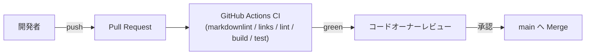

# Deployment Architecture — UoW-H React アダプタ

- **関連 Issue**: [#46](https://github.com/AtsutoNakayama/perisphere/issues/46)
- **作成日**: 2026-08-04

## 現時点の配布フロー（UoW-A〜G から変更なし）

UoW-A〜G の `deployment-architecture.md` と同一のフロー。UoW-H によるインフラ変更はない。npm 公開フローは引き続き未構築（`@perisphere/core`・`@perisphere/react` いずれも `private: true` のまま）。

## UoW-H 完了時点でのインフラ変更サマリ

なし。`packages/react/` の新規追加のみで、既存 CI ジョブ（`lint`/`build`/`test`）が `pnpm -r` により自動的にカバーする。
