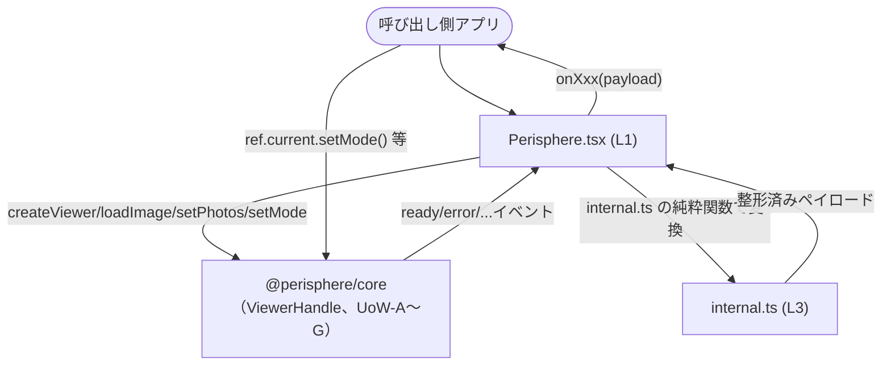

# Logical Components — UoW-H React アダプタ

- **関連 Issue**: [#46](https://github.com/AtsutoNakayama/perisphere/issues/46)
- **作成日**: 2026-08-04
- **前提資料**: `uow-h-nfr-design-plan.md`、`construction/uow-h/functional-design/domain-entities.md`、`nfr-design-patterns.md`

`domain-entities.md` のエンティティに、本ステージで確定したパターン（`nfr-design-patterns.md`）を適用した論理コンポーネントとしての役割を対応付ける。UoW-A〜G の `logical-components.md`（各ユニット独立採番）とは独立に、本ドキュメント内で L1 から採番する。パッケージ配置は `packages/react/src/`。

## 1. 論理コンポーネント一覧

| # | 論理コンポーネント | 対応エンティティ | 適用パターン |
|---|---|---|---|
| L1 | `Perisphere.tsx`（コンポーネント本体） | E3 | RP-H-1（Silent Best-Effort Load）。配置は `packages/react/src/Perisphere.tsx` |
| L2 | `usePerisphere.ts`（フック） | E4 | なし（単純な `useRef` ラップ） |
| L3 | `internal.ts`（純粋関数） | （新規、`business-rules.md` BR-H-05/BR-H-08/BR-H-10） | LC-H-1（PBT 対象の独立モジュール化） |
| L4 | `types.ts`（`PerisphereProps`/`PerisphereHandle`） | E1, E2 | なし（型定義のみ） |
| L5 | `index.ts`（バレルエクスポート） | E1〜E4 | なし |

## 2. L1 `Perisphere.tsx`

```tsx
// packages/react/src/Perisphere.tsx
import { forwardRef, useEffect, useImperativeHandle, useRef } from "react";
import { createViewer } from "@perisphere/core";
import type { ViewerHandle } from "@perisphere/core";
import { extractViewerOptions, resolveInitialSource, toCallbackPayload } from "./internal.js";
import type { PerisphereHandle, PerisphereProps } from "./types.js";

export const Perisphere = forwardRef<PerisphereHandle, PerisphereProps>(function Perisphere(
  props,
  forwardedRef,
) {
  const { className, style, image, photos, mode } = props;
  const rootRef = useRef<HTMLDivElement>(null);
  const handleRef = useRef<ViewerHandle | null>(null);

  // P1: マウント時初期化（BR-H-01, BR-H-02）
  useEffect(() => {
    const container = rootRef.current!;
    const handle = createViewer(container, extractViewerOptions(props)); // BR-H-08
    handleRef.current = handle;                                           // P2（BR-H-04）

    const initial = resolveInitialSource(image, photos);                  // BR-H-05
    if (initial.kind === "photos") handle.setPhotos(initial.value);
    if (initial.kind === "image") handle.loadImage(initial.value).catch(() => {}); // RP-H-1
    if (mode !== undefined) handle.setMode(mode);

    return () => {
      handle.dispose();                                                    // P5（BR-H-11）
      handleRef.current = null;
    };
    // eslint-disable-next-line react-hooks/exhaustive-deps -- マウント時1回のみ実行する意図的な設計（BR-H-02, Q7）
  }, []);

  useImperativeHandle(forwardedRef, () => handleRef.current as PerisphereHandle, []); // P2

  useEventBridge(handleRef, props); // P3（L1 内のプライベートフック、LC-H-2）

  // P4: props 変更の反映（BR-H-06）
  useEffect(() => {
    if (photos !== undefined) handleRef.current?.setPhotos(photos);
  }, [photos]);
  useEffect(() => {
    if (photos === undefined && image !== undefined) {
      handleRef.current?.loadImage(image).catch(() => {}); // RP-H-1
    }
  }, [image, photos]);
  useEffect(() => {
    if (mode !== undefined) handleRef.current?.setMode(mode);
  }, [mode]);

  return <div ref={rootRef} className={className} style={style} />; // BR-H-01
});
```

- **設計意図**: マウント時初期化（P1）・ref 公開（P2）・イベントブリッジ（P3、`useEventBridge` へ委譲）・props 反映（P4）・破棄（P5）の5つの関心事を、`business-logic-model.md` のプロセス番号と1対1で対応させる。`internal.ts`（L3）の純粋関数を呼ぶだけで、DOM/React 固有の処理（`ref`/`useEffect`）と計算ロジックを分離する。

### L1 内のプライベートフック `useEventBridge`（LC-H-2）

```ts
// Perisphere.tsx 内のプライベート関数（独立ファイル化しない、Q3=A）
function useEventBridge(
  handleRef: RefObject<ViewerHandle | null>,
  callbacks: Pick<PerisphereProps, `on${string}`>, // 実装時は8個のonXxxを明示的に列挙
): void {
  const callbacksRef = useRef(callbacks);
  callbacksRef.current = callbacks; // レンダリングのたびに最新値を代入（BR-H-09）

  useEffect(() => {
    const handle = handleRef.current;
    if (!handle) return;
    const subscriptions = EVENT_TYPES.map((type) => {
      const handler = (event: ViewerEventMap[typeof type]) => {
        const callback = callbacksRef.current[toPropName(type)];
        callback?.(toCallbackPayload(event)); // internal.ts（L3）
      };
      handle.on(type, handler);
      return { type, handler };
    });
    return () => {
      for (const { type, handler } of subscriptions) handle.off(type, handler);
    };
    // eslint-disable-next-line react-hooks/exhaustive-deps -- 購読は mount 時1回のみ、callback は ref 経由で最新値を参照する意図的な設計（BR-H-09）
  }, [handleRef]);
}
```

## 3. L2 `usePerisphere.ts`

```ts
// packages/react/src/usePerisphere.ts
import { useRef } from "react";
import type { PerisphereHandle } from "./types.js";

export function usePerisphere(): { ref: React.RefObject<PerisphereHandle | null> } {
  return { ref: useRef<PerisphereHandle | null>(null) };
}
```

- **設計意図**: `domain-entities.md` E4 の通り、状態やライフサイクルを持たない最小限のヘルパー。

## 4. L3 `internal.ts`（純粋関数）

```ts
// packages/react/src/internal.ts（LC-H-1）
import type { ImageInput, PhotoInput, ViewerEventMap, ViewerEventType, ViewerOptions } from "@perisphere/core";
import type { PerisphereProps } from "./types.js";

type ResolvedSource =
  | { kind: "photos"; value: readonly PhotoInput[] }
  | { kind: "image"; value: ImageInput }
  | { kind: "none" };

export function resolveInitialSource(
  image: ImageInput | undefined,
  photos: readonly PhotoInput[] | undefined,
): ResolvedSource {
  if (photos !== undefined) return { kind: "photos", value: photos };   // BR-H-05
  if (image !== undefined) return { kind: "image", value: image };
  return { kind: "none" };
}

const KNOWN_PROP_KEYS = [
  "image", "photos", "mode", "className", "style",
  "onReady", "onError", "onProgress", "onModeChange",
  "onViewChange", "onZoomChange", "onPhotoChange", "onFullscreenChange",
] as const;

export function extractViewerOptions(props: PerisphereProps): ViewerOptions {
  const rest: Record<string, unknown> = { ...props };                   // BR-H-08
  for (const key of KNOWN_PROP_KEYS) delete rest[key];
  return rest as ViewerOptions;
}

export function toCallbackPayload<K extends ViewerEventType>(
  event: ViewerEventMap[K],
): unknown {
  if (event.type === "ready") return undefined;                        // BR-H-10
  if (event.type === "error") return event.error;
  const { type: _type, ...rest } = event;
  return rest;
}
```

- **設計意図**: React/DOM に一切依存しない。`nfr-requirements.md` §4（Q4）で確定した不変条件を、`packages/react` のテストから直接 import して PBT（fast-check）で検証する。

## 5. L4 `types.ts`

`PerisphereProps`/`PerisphereHandle`（`domain-entities.md` E1/E2）を定義する。`PerisphereHandle` は `@perisphere/core` の `ViewerHandle` の型エイリアス（設計判断、`domain-entities.md` 参照）。

## 6. L5 `index.ts`

```ts
// packages/react/src/index.ts
export { Perisphere } from "./Perisphere.js";
export { usePerisphere } from "./usePerisphere.js";
export type { PerisphereHandle, PerisphereProps } from "./types.js";
```

## 7. コンポーネント間の協調（統合シーケンス）



### テキスト代替

```text
呼び出し側アプリは Perisphere（L1）に宣言的 props（image/mode/onReady 等）と ref を渡す。
L1 は mount 時に @perisphere/core の createViewer/loadImage/setPhotos/setMode を呼び、
コアから発火するイベントを internal.ts（L3）の純粋関数で整形したうえで onXxx コールバックとして
アプリへ橋渡しする。アプリは ref 経由でも同じ ViewerHandle（= PerisphereHandle）の
メソッドを直接呼べる（宣言的・命令的の両立、frontend-components.md 参照）。
```
