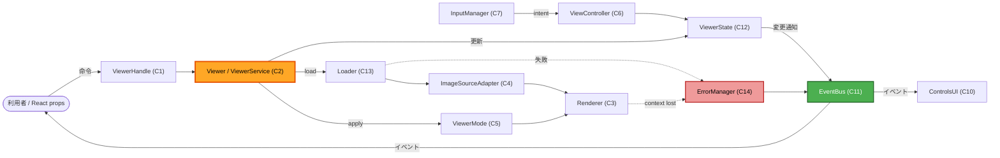

# Component Dependency — perisphere（依存マトリクス・通信パターン・データフロー）

- **関連 Issue**: [#21](https://github.com/AtsutoNakayama/perisphere/issues/21)
- **作成日**: 2026-06-29

## 依存マトリクス（行が列に依存）

凡例: ● 直接依存 / ○ イベント購読のみ（疎結合） / 空欄 なし

| ↓依存元 \ 依存先→ | Viewer(C2) | Renderer(C3) | Source(C4) | Mode(C5) | ViewCtrl(C6) | Input(C7) | Gallery(C8) | FullScr(C9) | UI(C10) | EventBus(C11) | State(C12) | Loader(C13) | Error(C14) |
|---|---|---|---|---|---|---|---|---|---|---|---|---|---|
| Viewer (C2) | - | ● | ● | ● | ● | ● | ● | ● | ● | ● | ● | ● | ● |
| Renderer (C3) | | - | | ● | | | | | | | | | ● |
| Source (C4) | | | - | | | | | | | | | ● | ● |
| Mode (C5) | | ● | | - | ● | | | | | | | | |
| ViewController (C6) | | | | | - | | | | | | ● | | |
| InputManager (C7) | | | | | ● | - | | | | ○ | | | |
| Gallery (C8) | | | | | | | - | | | ● | ● | | |
| FullscreenMgr (C9) | | | | | | | | - | | ● | ● | | ● |
| ControlsUI (C10) | ●(handle) | | | | | | | | - | ○ | ○ | | |
| EventBus (C11) | | | | | | | | | | - | | | |
| ViewerState (C12) | | | | | | | | | | ● | - | | |
| Loader (C13) | | | | | | | | | | | | - | ● |
| ErrorManager (C14) | | | | | | | | | | ● | ● | | - |

要点:

- **C2 Viewer がハブ**（オーケストレータ）。他コンポーネントは互いを直接知らず、Viewer が結線する（疎結合）。
- **UI(C10) と Input(C7) は EventBus/State を購読**し、コア内部状態を直接書き換えない（一方向データフロー）。
- **ErrorManager(C14) は EventBus 経由で error を発火**し、各所はそれを購読してフォールバック表示。

## 通信パターン

- **命令（呼び出し）**: 利用者 → `ViewerHandle`(C1) → `Viewer`(C2) → 各コンポーネント。同期メソッド呼び出し。
- **通知（イベント）**: コンポーネント → `EventBus`(C11) → 購読者（利用者 / UI / アダプタ）。型付き Emitter（Q3=C）。
- **状態**: `ViewerState`(C12) はプレーン保持（Q6=A）。変更時に EventBus へ発火。外部リアクティブライブラリ非依存（NFR-06）。
- **拡張登録**: `registerMode/registerSource/registerInputSource` はインスタンス単位（Q4=A）。グローバル副作用なし。

## データフロー（主要 3 経路）

### Mermaid



### Text Alternative

```text
[1] 命令フロー:
    利用者/React props -> ViewerHandle(C1) -> Viewer(C2) -> 各コンポーネント

[2] ロードフロー:
    Viewer -> Loader(C13)[検証/取得/デコード] -> ImageSourceAdapter(C4)[テクスチャ生成]
          -> Renderer(C3)[反映]   ／ 失敗時 -> ErrorManager(C14)

[3] 描画/操作フロー:
    InputManager(C7)[intent] -> ViewController(C6) -> ViewerState(C12)
          -> EventBus(C11)[viewchange/zoomchange] -> UI(C10) / 利用者
    Viewer -> ViewerMode(C5).apply -> Renderer(C3)[毎フレーム描画]

[エラー経路]:
    Loader/Renderer の失敗・context lost -> ErrorManager(C14) -> EventBus -> 購読者（フォールバック表示）
```

## 横断的関心の依存

- **Disposable(C15)**: 全 three.js/DOM/リスナー保持コンポーネント（C3,C4,C7,C9,C10,C11）が実装し、C2 が逆順に呼ぶ（US-31）。
- **SSR セーフ(NFR-03)**: ブラウザ API への依存は C3/C7/C9/C10 に局在。module トップレベルでは参照せず、C2 の初期化（クライアント）以降に限定。
- **React アダプタ(C16〜C18)**: `@perisphere/core` の `ViewerHandle`(C1) にのみ依存。コア内部（C2 以降）には依存しない（一方向・薄いラッパ Q7=A）。
