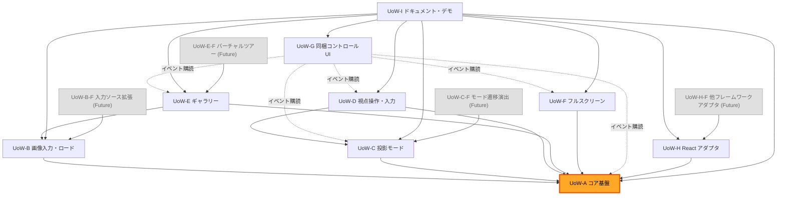

# Unit of Work Dependency — perisphere（ユニット間依存マトリクス・実装順）

- **関連 Issue**: [#21](https://github.com/AtsutoNakayama/perisphere/issues/21)
- **作成日**: 2026-07-20
- **前提資料**: `unit-of-work.md`、`component-dependency.md`
- **決定方針**: Q6=A（基盤優先。最初の縦切りの到達点は「1 枚を標準ビューで表示」）

## 依存マトリクス（行が列に依存）

凡例: ● 実装依存（ビルド/公開 IF が必要） / ○ イベント購読のみ（疎結合・実行時のみ） / 空欄 なし

| ↓依存元 \ 依存先→ | A | B | C | D | E | F | G | H |
|---|---|---|---|---|---|---|---|---|
| UoW-A コア基盤 | - | | | | | | | |
| UoW-B 画像入力・ロード | ● | - | | | | | | |
| UoW-C 投影モード | ● | | - | | | | | |
| UoW-D 視点操作・入力 | ● | | ● | - | | | | |
| UoW-E ギャラリー | ● | ● | | | - | | | |
| UoW-F フルスクリーン | ● | | | | | - | | |
| UoW-G 同梱コントロール UI | ○ | | ○ | ○ | ○ | ○ | - | |
| UoW-H React アダプタ | ●(IF) | | | | | | | - |

| ↓依存元 \ 依存先→ | 対応する In MVP ユニット | A |
|---|---|---|
| UoW-B-F 入力ソース拡張（Future） | UoW-B（●） | ● |
| UoW-C-F モード遷移演出（Future） | UoW-C（●） | ● |
| UoW-E-F バーチャルツアー拡張点（Future） | UoW-E（●） | ● |
| UoW-H-F 他フレームワークアダプタ（Future） | UoW-H（参照のみ・パターン踏襲） | ● |
| UoW-I ドキュメント・デモ | A〜H すべて（●・利用のため） | ● |

要点:

- **UoW-A がハブ**（`component-dependency.md` の C2 Viewer と同じ構図）。UoW-B〜H はいずれも UoW-A に依存し、循環はない（DAG）。
- **UoW-G のみ実行時は疎結合**（EventBus 購読）。ビルド時の型依存は最小限だが、意味のある動作検証には C/D/E/F のイベント定義が出揃っている必要がある（`unit-of-work.md` の備考参照）。
- **UoW-H の直接依存は UoW-A（`ViewerHandle`）のみ**（`component-dependency.md` の通りコア内部には非依存）。ただし委譲先の機能（B〜G）が揃っていないと結合検証ができないため、実装順は最後寄りに置く。
- **循環依存なし**: A を根とする DAG（A → {B,C,D,E,F,G,H} → 各 Future/I）であることを確認済み。

## 依存グラフ（Mermaid）



### Text Alternative

```text
実装依存（実線）:
  B -> A
  C -> A
  D -> A, C
  E -> A, B
  F -> A
  H -> A
  I -> A, B, C, D, E, F, G, H
  BF(Future) -> B
  CF(Future) -> C
  EF(Future) -> E
  HF(Future) -> H

イベント購読のみ（疎結合・点線）:
  G -> A, C, D, E, F（EventBus 経由の状態反映。ビルド時の強依存ではない）
```

## 実装順（マイルストーン / Q6=A 基盤優先＋最初の縦切り）

| # | マイルストーン | ユニット | 到達点 |
|---|---|---|---|
| M1 | 基盤 | UoW-A | コア初期化（SSR セーフ）・描画ループ・イベント・状態・エラー基盤が動作 |
| M2 | 画像入力 | UoW-B | エクイレクタングラー画像を取得・検証・テクスチャ化できる |
| **— 最初の縦切り到達点 —** | | **UoW-A + UoW-B** | **「1 枚の画像を標準ビューで表示」できる（Q6=A の到達点）** |
| M3 | 投影モード | UoW-C | 標準以外の 6 モードへの切替・拡張登録ができる |
| M4 | 視点操作・入力 | UoW-D | マウス/タッチ/キーボードでパン・チルト・ズームができる |
| M5 | ギャラリー | UoW-E | 複数写真の切替ができる |
| M6 | フルスクリーン | UoW-F | フルスクリーン切替・フォールバックができる |
| M7 | 同梱コントロール UI | UoW-G | 標準 UI で M3〜M6 の操作ができる |
| M8 | React アダプタ | UoW-H | React コンポーネント/フック/ref で利用できる |
| M9 | ドキュメント・デモ | UoW-I | API リファレンス・デモ・サンプルが揃う |
| Backlog | Future 拡張 | UoW-B-F, UoW-C-F, UoW-E-F, UoW-H-F | 優先度未定。対応する In MVP ユニット完了後、必要になった時点で個別 Issue 化 |

- M1・M2 は依存上ここで確定だが、順序自体に自由度はない（B は A に依存）。
- M3〜M7 は依存グラフ上は互いに独立（D→C のみ有向）なため、チームの状況に応じて M3〜M4 を並行、M5〜M7 を並行するなど順序の入れ替えは可能。表の順序は `unit-of-work-plan.md` Q6=A の暫定候補順（UoW-A〜I）をそのまま採用したもの。
- M8（React アダプタ）と M9（ドキュメント・デモ）は依存グラフ上すべてのユニットを要するため最後に固定。
