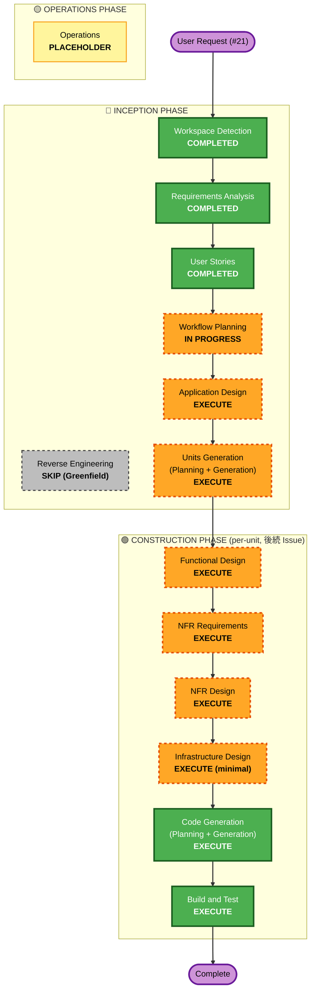

# Execution Plan — perisphere（360°写真 Web ビューワーライブラリ）

- **関連 Issue**: [#21](https://github.com/AtsutoNakayama/perisphere/issues/21)
- **作成日**: 2026-06-29
- **ステータス**: レビュー待ち（Workflow Planning 成果物）
- **前提資料**: `inception/requirements/requirements.md`、`inception/user-stories/stories.md`、`inception/user-stories/personas.md`

## Detailed Analysis Summary

### Transformation Scope

- グリーンフィールド（既存製品コードなし）。Brownfield 固有の変換スコープ分析・コンポーネント関係マッピングは N/A。
- 新規システム = フレームワーク非依存コア（`@perisphere/core`）＋ React アダプタ（`@perisphere/react`）＋ ドキュメント/デモを含むモノレポ。

### Change Impact Assessment

- **User-facing changes**: Yes — 7 種のビューワーモード、視点操作（マウス/タッチ/キーボード）、フルスクリーン、ギャラリー、標準コントロール UI。エンドユーザー（P2）と組み込み開発者（P1）双方に直接影響。
- **Structural changes**: Yes — コア/アダプタ分離のモノレポ構成、拡張点（入力フォーマット・ビューワーモード・入力デバイス・将来のツアー/動画）を公開インターフェースとして設計（NFR-05）。
- **Data model changes**: Yes（ライブラリ内部）— 投影パラメータ、ビューワー状態（モード・FOV・視点）、ギャラリー状態、イベントペイロードのモデル定義が必要。永続データストアは持たない。
- **API changes**: Yes — 公開 API そのものが製品。命令的 API・宣言的 props・ref ハンドル・イベント API・拡張登録 API の設計が中核。
- **NFR impact**: Yes — 性能（8K/60fps 目安）、SSR セーフ、アクセシビリティ、セキュリティ Baseline、レジリエンシー Baseline、PBT 全面適用。

### Risk Assessment

- **Risk Level**: Medium
  - 複雑性は高い（合成投影の数学、マルチパッケージ、高い拡張性要件）が、グリーンフィールドで稼働中の本番システムがなく、影響は将来の利用者向け。
- **Rollback Complexity**: Easy — 稼働サービス・永続データなし。成果物は Git / npm レジストリから復元可能（NFR-11）。リリース前は破壊的影響なし。
- **Testing Complexity**: Complex — 投影計算・座標変換・状態管理に PBT を全面適用（NFR-09）。クロスブラウザ/モバイル実機・WebGL 依存の検証が必要。

## Workflow Visualization

### Mermaid Diagram



### Text Alternative

```text
🔵 INCEPTION PHASE
- Workspace Detection ........ COMPLETED
- Reverse Engineering ........ SKIP (Greenfield)
- Requirements Analysis ...... COMPLETED
- User Stories ............... COMPLETED
- Workflow Planning .......... IN PROGRESS（本書）
- Application Design ......... EXECUTE
- Units Generation ........... EXECUTE

🟢 CONSTRUCTION PHASE（unit ごと・後続 Issue で実施 / #21 スコープ外）
- Functional Design .......... EXECUTE
- NFR Requirements ........... EXECUTE
- NFR Design ................. EXECUTE
- Infrastructure Design ...... EXECUTE (minimal)
- Code Generation ............ EXECUTE (always)
- Build and Test ............. EXECUTE (always)

🟡 OPERATIONS PHASE
- Operations ................. PLACEHOLDER
```

## Phases to Execute

### 🔵 INCEPTION PHASE

- [x] Workspace Detection (COMPLETED)
- [x] Reverse Engineering (SKIPPED — グリーンフィールドのため対象なし)
- [x] Requirements Analysis (COMPLETED — 承認 2026-06-17)
- [x] User Stories (COMPLETED — 承認 2026-06-29)
- [x] Execution Plan (IN PROGRESS)
- [ ] Application Design — **EXECUTE**
  - **Rationale**: 公開 API がそのまま製品であるライブラリのため、コアコンポーネント、投影抽象、入力アダプタ・ビューワーモード・入力デバイスの拡張インターフェース、ギャラリー、イベント/エラー処理、React アダプタの責務と公開インターフェースを設計する必要がある（FR-02/05、NFR-05）。
- [ ] Units Generation — **EXECUTE**
  - **Rationale**: モノレポを複数ユニット（コアエンジン、投影モジュール、視点操作/入力、ギャラリー、コントロール UI、React アダプタ、ドキュメント/デモ）へ分解する必要がある。マルチパッケージ・後続 Issue 単位の実装計画の土台になる。

### 🟢 CONSTRUCTION PHASE（unit ごとに実施・Issue #21 のスコープ外 / 後続 Issue で着手）

> 注: Construction の各ステージは「ユニットごと」に条件判定して実行する。下記はプラン時点の暫定推奨であり、ユニット確定後に最終判断する。

- [ ] Functional Design — **EXECUTE**
  - **Rationale**: 投影計算（純粋関数）・座標変換、ビューワー状態/ギャラリー状態の遷移、イベントペイロード等、複雑なビジネスロジックとデータモデルの詳細設計が必要。PBT のプロパティ特定（PBT-01）もここで行う。
- [ ] NFR Requirements — **EXECUTE**
  - **Rationale**: 技術スタック確定（three.js バージョン範囲、TypeScript、ビルド/バンドラ、PBT フレームワーク選定 PBT-09）、性能予算（8K/60fps 目安）、セキュリティ/レジリエンシーの具体要件確定が必要。
- [ ] NFR Design — **EXECUTE**
  - **Rationale**: SSR セーフ実装パターン、リソース破棄、WebGL コンテキストロスト復帰、性能戦略、CI/CD・ロールバック・リリース様式（RESILIENCY-04）などの設計が必要。
- [ ] Infrastructure Design — **EXECUTE（minimal depth）**
  - **Rationale**: 稼働サーバー・クラウドリソースは持たない（RESILIENCY-05〜09 は N/A）が、npm 公開パイプライン・デモサイトの静的ホスティング・CI リリース手順といった「配布/デプロイ」面の最小限のマッピングが必要。重量級のクラウドインフラ設計は対象外。
- [ ] Code Generation — **EXECUTE（ALWAYS）**
  - **Rationale**: 実装計画と各ユニットのコード/テスト生成。
- [ ] Build and Test — **EXECUTE（ALWAYS）**
  - **Rationale**: ビルド・ユニット/プロパティテスト・統合テスト・性能/アクセシビリティ検証。

### 🟡 OPERATIONS PHASE

- [ ] Operations — **PLACEHOLDER**
  - **Rationale**: 将来のデプロイ・監視ワークフロー用プレースホルダ。

## Estimated Timeline

- **Total Phases（残り）**: INCEPTION 2 ステージ（Application Design、Units Generation）＋ CONSTRUCTION（ユニット数に依存）。
- **Estimated Duration**: Inception 残りは数セッション。Construction は本 Issue（#21）のスコープ外で、ユニットごとに後続 Issue を起票して実施。

## Success Criteria

- **Primary Goal**: 7 種のビューワーモードと高い拡張性を備えた 360°写真 Web ビューワーライブラリの設計・実装計画を確立し、後続のユニット実装に着手できる状態にする。
- **Key Deliverables**: Application Design 成果物、ユニット分解（Units Generation）、各ユニットの Construction 成果物（後続）。
- **Quality Gates**:
  - 全 FR/NFR がストーリー → 設計 → ユニットへトレース可能であること。
  - 有効化された拡張（Security Baseline / Resiliency Baseline / Property-Based Testing）の該当ルールに準拠すること。
  - 命名ポリシー（中立名のみ・第三者製品名を出さない）を全公開成果物で遵守すること。
  - CI（Markdown lint / Link check）がグリーンであること。
